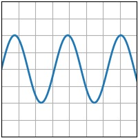
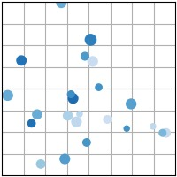
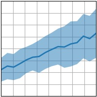
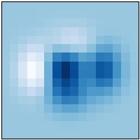
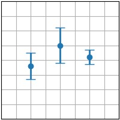
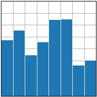
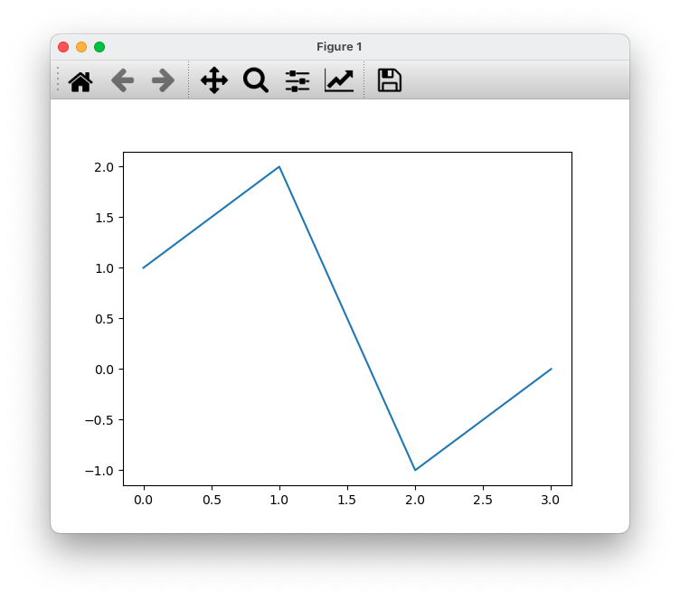

---
jupytext:
  text_representation:
    extension: .md
    format_name: myst
    format_version: 0.13
    jupytext_version: 1.14.4
kernelspec:
  display_name: Python 3 (ipykernel)
  language: python
  name: python3
---


# Importing Matplotlib and creating your first plot

Matplotlib is a standard for producing high-quality and interactive figures. The pyplot module is highly similar to Matlab's plotting functions, and offers an easy-to-understand, yet very powerful way to produce figures.

:::{figure}
:label: matplotlib_logo
:width: 4in


Matplotlib logo
:::


Matplotlib can generate a wide variety of plots. Here are different examples that are relevant to biomechanics, reproduced from the {{matplotlib}} website:


|              {{plt_plot}}               |              {{plt_scatter}}               | 
|:---------------------------------------:|:------------------------------------------:|
|  |  |

|              {{plt_fill_between}}               |              {{plt_imshow}}               |
|:-----------------------------------------------:|:-----------------------------------------:|
|  |  |

|              {{plt_errorbar}}               |              {{plt_bar}}               | 
|:-------------------------------------------:|:--------------------------------------:|
|  |  |

This chapter focuses solely on line plots using {{plt_plot}}. However, after learning this type of plot and [](../4%20Manipulating%20Arrays%20using%20Numpy/1%20numpy.md), any other type of plot will become relatively easy to draw just by reading their documentation.


## Importing **pyplot**

Matplotlib, like many other libraries such as {{numpy}} or {{pandas}}, is a package that needs to be installed in addition to the standard Python packages. Normally, it should already be installed in your setup; if not, please refer to section [](../1%20Getting%20Started/2_getting_started_installing.md) to install it.

Even if a package is installed, we need to tell Python to import its contents before using it. This is usually done at the beginning of the Python script, using the `import` statement. For the {{pyplot}} module of the {{matplotlib}} package, we would write:

```{code-cell} ipython3
import matplotlib.pyplot
```

Once imported, we can access the module's contents under the `matplotlib.pyplot` namespace:

```{code-cell} ipython3
matplotlib.pyplot.plot([0, 1, 4], "o-");
```

:::{note}
A **namespace** is a name that groups different objects (functions, variables, classes). It is used to avoid ambiguities between two modules that could use identical names to define their respective objects. For instance, Python provides the function `max` that returns the maximum value between two floats. NumPy also provides a function `max` that returns the maximum value of an array. Namespaces avoid name clashes: Python's max is accessed using `max()`, while NumPy's max is accessed using `numpy.max()`.
:::

To avoid typing `matplotlib.pyplot` each time we need a pyplot function, it is very common to import it using an alias:

```{code-cell} ipython3
import matplotlib.pyplot as plt
```

This line behaves like the previous import, but this time `matplotlib.pyplot` is imported into the `plt` namespace instead of the `matplotlib.pyplot` namespace. This leads to shorter and cleaner lines of code.


## Plotting a line graph

The most common command of Matplotlib's pyplot module is probably {{plt_plot}}. This function plots one or many series expressed either as [standard Python lists](../2%20Learning%20Python/6_python_lists.md), as [NumPy Arrays](../4%20Manipulating%20Arrays%20using%20Numpy/2_numpy_ndarray.md), or as `Pandas DataFrames`. For one-dimensional data, it takes one list (y) or two lists (x, y) as arguments.

For example, to plot this list: `[1.0, 2.0, -1.0, -0.0]`:

```
import matplotlib.pyplot as plt

y = [1.0, 2.0, -1.0, -0.0]
plt.plot(y)
```

:::{figure}
:label: fig_matplotlib_qt5
:width: 5in


A Matplotlib figure window.
:::

You should normally see the plot in a new window, as shown in {numref}`fig_matplotlib_qt5`. If, instead, you see the figure inline, or in Spyder's *Graph* pane, or not at all, then you probably did not configure Matplotlib for interactive graphics. See [](../1%20Getting%20Started/3_getting_started_configuring_spyder.md).

The different buttons on the figure allow some interaction with the plot:

|                      Icon                       | Function                         |
| :---------------------------------------------: | -------------------------------- |
|          | Move the figure around (panning) |
|  | Zoom                             |
|          | Undo the last pan/zoom operation |
|       | Redo the last pan/zoom operation |
|          | Reset to the initial pan/zoom    |
|      | Save the figure to an image file |

By default, `x` starts at 0 and increments by 1 for each point. But we can also specify custom coordinates for `x`:

```{code-cell} ipython3
import matplotlib.pyplot as plt

y = [1.0, 2.0, -1.0, -0.0]
x = [0.0, 5.0, 10.0, 15.0]

plt.plot(x, y);
```

The `x` values don't have to be equidistant:

```{code-cell} ipython3
x = [0.0, 0.5, 1, 10]

plt.plot(x, y);
```

