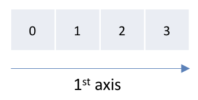
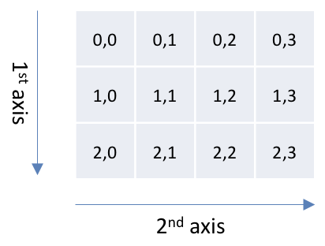
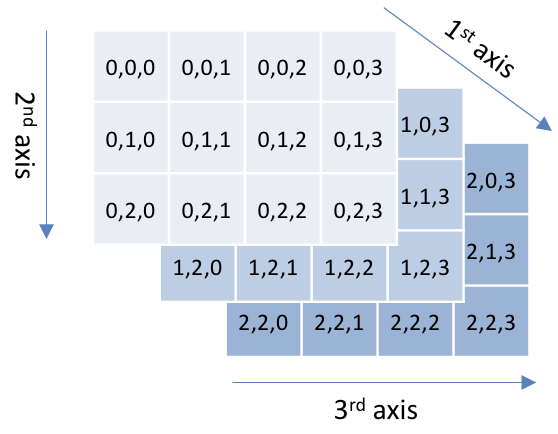

---
jupytext:
  text_representation:
    extension: .md
    format_name: myst
    format_version: 0.13
    jupytext_version: 1.14.4
kernelspec:
  display_name: Python 3 (ipykernel)
  language: python
  name: python3
---

# Arrays

NumPy arrays allow expressing data in series, tables and even in more dimensions, which allows representing vectors, matrices and series of matrices. This is absolutely required for biomechanical analysis, and therefore the next sections present how to create and work with arrays.

While a NumPy array could be seen as an extension of the [Python lists](../2%20Learning%20Python/6_python_lists.md) list to multiple dimensions, it has fundamental differences which make both types powerful in their own ways. The main differences between both types are:

| Lists                                                                                                                                        | Arrays                                                                                      |     |
| -------------------------------------------------------------------------------------------------------------------------------------------- | ------------------------------------------------------------------------------------------- | --- |
| Are unidimensional. We can use nested lists to simulate multiple dimensions, but these values are harder to access, calculate, reshape, etc. | Can have any number of dimensions; they can represent matrices, or even series of matrices. |     |
| Can be a sequence of different types, which makes them very versatile.                                                                       | Only hold elements of the same type.                                                        |     |
| Have a dynamic size that can be modified using `append`, `expand` and `pop`.                                                                 | Have a fixed size, they cannot expand as lists do.                                          |     |
| Only hold data, they don't provide methods to compute data.                                                                                  | Can be used directly for calculations such as linear algebra, filtering, etc.               |     |

Lists and arrays can be converted one to the other, as we will see in [](numpy_ndarray_creating_from_lists.md).


## Array dimensions

Each dimension of a NumPy array has a corresponding axis, which allows addressing any value in the array.

The **shape** of an array is its size on each of its dimensions. We get this information using its {{ndarray_shape}} property.


### One dimension



Every value is accessed exactly like a list:

- 1st value: `the_array[0]`
- 2nd value: `the_array[1]`
- etc.

shape = `(4,)`


### Two dimensions



Every value is accessed using two coordinates. For a matrix, these coordinates are:

1. the row
2. the column

For example: 

- 1st row, 1st column: `the_array[0, 0]`
- 2nd row, 3rd column: `the_array[1, 2]`
- etc.

shape = `(3, 4)`


### Three dimensions



Every value is accessed using three coordinates. For a series of matrices, these coordinates are:

1. the matrix in the series
2. the row
3. the column

For example: 

- 1st matrix, 1st row, 1st column: `the_array[0, 0, 0]`
- 1st matrix, 2nd row, 3rd column: `the_array[0, 1, 2]`
- etc.

shape = `(3, 3, 4)`


:::{note}
Note the trailing comma after the 4 in the notation `(4,)` above. It is required to avoid confusing the tuple delimiter `()` with standard parentheses `()`. Writing `(4)` without a comma is an integer in parentheses, while writing `(4,)` with a comma is a tuple of 1 value. The `shape` property of an array is always a tuple.
:::


## Creating arrays from lists

A simple way to create an array from a list is to use the {{np_array}} function. To create the one-dimensional array of {numref}`fig_array_1d_float`, we would write:

```{figure}
:label: fig_array_1d_float
:width: 2in


A one-dimensional array.
```

```{code-cell} ipython3
import numpy as np

array_1d = np.array([0.0, 0.1, 0.2, 0.3])

array_1d
```

It is also possible to convert back an array to a list, using its {{ndarray_tolist}} method:

```{code-cell} ipython3
array_1d.tolist()
```

To create the two-dimensional array of {numref}`fig_array_2d_float`, we would use nested lists:

```{figure}
:label: fig_array_2d_float
:width: 3in


A two-dimensional array.
```

```{code-cell} ipython3
array_2d = np.array(
    [
        [0.0, 0.1, 0.2, 0.3],
        [0.4, 0.5, 0.6, 0.7],
        [0.8, 0.9, 1.0, 1.1],
    ]
)

array_2d
```


To create the three-dimensional array of {numref}`fig_array_3d_float`, we would use multiple levels of nested lists:

```{figure}
:label: fig_array_3d_float
:width: 4in


A three-dimensional array.
```

```{code-cell} ipython3
array_3d = np.array(
    [
        [
            [0.0, 0.1, 0.2, 0.3],
            [0.4, 0.5, 0.6, 0.7],
            [0.8, 0.9, 1.0, 1.1],
        ],
        [
            [1.2, 1.3, 1.4, 1.5],
            [1.6, 1.7, 1.8, 1.9],
            [2.0, 2.1, 2.2, 2.3],
        ],
        [
            [2.4, 2.5, 2.6, 2.7],
            [2.8, 2.9, 3.0, 3.1],
            [3.2, 3.3, 3.4, 3.5],
        ],
    ]
)

array_3d
```


## Creating arrays of zeros or ones

To create arrays filled with zeros or ones, we use the {{np_zeros}} and {{np_ones}} functions, which both take the shape of the array to create:

```{code-cell} ipython3
import numpy as np

np.zeros((2, 5))
```

```{code-cell} ipython3
np.ones((3, 4))
```

:::{tip}
Note the double parentheses. The argument of {{np_zeros}} and {{np_ones}} is a shape, which is a tuple. Writing `np.zeros(2, 5)` would generate an error, since this is not one tuple argument, but two integer arguments.
:::


## 💪 Exercise 1

We recorded the force measured by a dynamometer at a sampling frequency of 100 Hz, during 2.5 seconds. Unfortunately, the dynamometer was not plugged in, and we only recorded a series of zeros.

Using one line of code, create a NumPy array named `force` that contains this series of zeros.

```{code-cell} ipython3
:tags: [hide-cell]
import numpy as np

# The number of points is 2.5 * 100Hz = 250.

force = np.zeros(250)

force
```


## 💪 Exercise 2

Using a single line of code, create a 15x3 matrix that contains only ones.

```{code-cell} ipython3
:tags: [hide-cell]
import numpy as np

np.ones((15, 3))
```

## Creating linearly spaced arrays

It is very common to generate one-dimensional arrays of equally spaced values, such as `[0, 1, 2, 3, 4]` or `[0, 0.1, 0.2, 0.3]`. We can do it using:

```{code-cell} ipython3
import numpy as np

np.array(range(5))
```

which creates a range from 0 (inclusive) to 5 (exclusive), then converts this range to an array. NumPy provides a shortcut for this: {{np_arange}}

```{code-cell} ipython3
np.arange(5)
```

This function takes the same arguments as Python's [range](../2%20Learning%20Python/python_for.md) function.

:::{tip} np.arange
While `range` only accepts integers as arguments, `np.arange` also accepts floats. For example:

```
np.arange(0, 0.5, 0.1)
```

generates:

```
array([0. , 0.1, 0.2, 0.3, 0.4])
```

However, this practice is not always recommended due to potential floating-point issues that cannot guarantee the length of the resulting array. Without delving further into these issues, just remind that in most cases, `np.arange` should be used only with integers. For the example above:

```
np.arange(5) / 10
```

is safer and gives the same result:

```
array([0. , 0.1, 0.2, 0.3, 0.4])
```
:::

Another function to create equally spaced series of floats is {{np_linspace}}, which takes as arguments the initial value, the final value, and the number of points in the new array. By default, `np.linspace` includes both the initial and final values as arguments. For example, to create an array that goes from 5.0 (inclusive) to 10.0 (inclusive) and that contains 11 elements:

```{code-cell} ipython3
np.linspace(5.0, 10.0, 11)
```

To exclude the final value, set the `endpoint` argument to False.

```{code-cell} ipython3
np.linspace(5.0, 10.0, 10, endpoint=False)
```


## 💪 Exercise 3

We recorded the force measured by a dynamometer at a sampling frequency of 100 Hz for 2.5 seconds.

Using one line of code (excluding the `import` line), create a NumPy array named `time` that represents the time corresponding to each sample. The first element of this array will be 0, the second will be 0.01, and so on.

```{code-cell} ipython3
:tags: [hide-cell]
import numpy as np

# The initial time is 0 s
# The final time corresponds to 2.5 seconds
# The number of points is 2.5 * 100Hz = 250.

time = np.linspace(0, 2.5, 250, endpoint=False)

# Note that if we interpret the question to include the final time, then we
# need to increase the number of points by 1 to include this new point:
# >> time = np.linspace(0, 2.5, 251)

time
```

