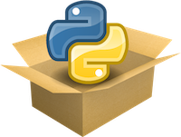

:::::{margin}

:::::

|    |      |
|----|------|
|    |  The Kinetics Toolkit project provides the open-source Python package [kineticstoolkit](https://pypi.org/project/kineticstoolkit) to facilitate research in biomechanics. It includes tools for analyzing time series (e.g., filtering, segmenting, splitting, resampling...); performing rigid body geometry operations, visualizing points, vectors and bodies interactively, and more. |
|    | Since programming can be hard for new users, Kinetics Toolkit also provides a complete reference book: [Biomechanical Analysis using Python and Kinetics Toolkit](https://kineticstoolkit.uqam.ca/book), which covers the Python programming language, Matplotlib, NumPy, and all the features of the kineticstoolkit package, with reproducible examples based on real, downloadable data.|

[Jump to the book to get started!](https://kineticstoolkit.uqam.ca/docs/book)
