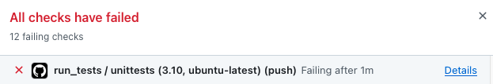

# Developing extensions

If you wrote code that extends Kinetics Toolkit and you want to share it globally, consider sharing it as a Kinetics Toolkit extension. This is the best way to ensure that your code keeps functioning in the future, since extensions are tested automatically and continuously with each Kinetics Toolkit release.

**Step 1. Fork `kineticstoolkit_extensions`**

On GitHub, fork the [kineticstoolkit_extensions](https://github.com/kineticstoolkit/kineticstoolkit_extensions) repository.

**Step 2. Add your code**

On your fork, add your new extension as `YOUR_EXTENSION_NAME.py` in the `kineticstoolkit_extensions` folder. Take [n3d.py](https://github.com/kineticstoolkit/kineticstoolkit_extensions/blob/main/kineticstoolkit_extensions/n3d.py) as an example. This file provides one function: `read_n3d`, which is available to the user as `kineticstoolkit.ext.n3d.read_n3d()`.

**Step 3. Add a tutorial**

On your fork, add a tutorial as a markdown (.md), python (.py) or jupyter notebook (.ipynb) named `YOUR_EXTENSION_NAME.md`, `YOUR_EXTENSION_NAME.py` or `YOUR_EXTENSION_NAME.ipynb` in the `tutorials` folder. This tutorial should teach the user what is the aim of your extension and how to use it.

If your tutorial requires data files, you can include these data in the `data` folder, and prefix your data by your extension name. For example: [data/n3d_sample_optotrak.n3d](https://github.com/kineticstoolkit/kineticstoolkit_extensions/tree/main/data). You can then refer to this data in your tutorial using:

```
filename = ktk.ext.root_folder + "/data/YOUR_DATAFILE_NAME"
```

such as:

```
filename = ktk.ext.root_folder + "/data/n3d_sample_optotrak.n3d"
```

**Step 4. Add unit tests**

A unit test is a function that is run automatically each time there is a new commit to either the `kineticstoolkit` repository, or the `kineticstoolkit_extensions` repository. Writing unit tests is a great way to ensure that your extension will keep running in the long term on all three main platforms (Windows, MacOS, Linux) and on every new version of Python, because we get a notification the minute it fails.

A unit test can be as simple as using a function on a given input and check that its output matches what we expect, using the `assert` command.

On your fork, add a nest file named `test_YOUR_EXTENSION_NAME.py` in the `tests` folder. Take [test_n3d.py](https://github.com/kineticstoolkit/kineticstoolkit_extensions/blob/main/tests/test_n3d.py) as an example. Each test function must begin with "test_". 

If your unit test requires data files, you can include and access these data like above in the "Add a tutorial" section.

**Step 5. Run the unit tests**

Commit all your files and push it to GitHub, then wait for the unit tests to be executed. If your unit tests do not pass, inspect the output on GitHub using "Details" and search for the error message.



Use this error message to correct your unit test (and maybe also your tutorial), then commit and push again.


**Running unit tests locally (optional)**

If your tests fail on GitHub and you have difficulty resolving them, you may want to run the unit tests locally, which allow you to debug with more tools. This is however a bit trickier because you need to install a local testing environment:

1. Checkout your fork of `kineticstoolkit_extensions` locally.
2. Uninstall `kineticstoolkit_extensions` that you may have previously installed using `pip`, `conda` or `mamba`.
3. Add the inner `kineticstoolkit_extensions` folder of your local checkout to your `PYTHONPATH` (in Spyder, you can use the PYTHONPATH manager to do that) - Now importing kineticstoolkit will import **your** extension in addition to the other extensions.
4. Install `pytest` using either `pip install pytest`, `mamba install pytest` or `conda install -c conda-forge pytest`.
5. Run your unit test file.


**Step 6. Create a Pull Request**

If all tests run successfully in your fork, create a Pull Request explaining what you added, and confirming that you have added a well-functioning tutorial and unit test. You will eventually get notified if changes are needed or if your pull request (PR) has been merged to the official `kineticstoolkit_extensions` repository.

In any step, do not hesitate to [ask for help](https://github.com/felixchenier/kineticstoolkit/discussions), it will be a pleasure to guide you.
