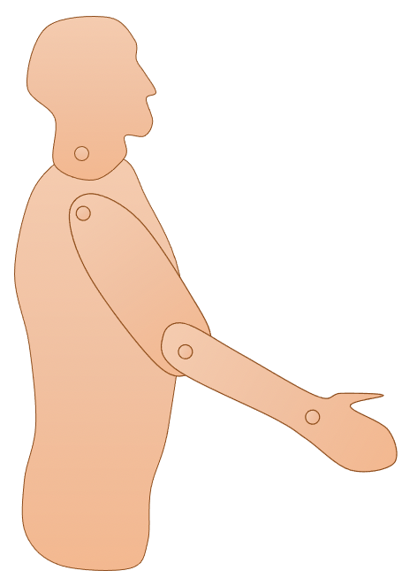

# Coordinates: points, vectors and frames

The following sections are an introduction or reminder of the basic elements of rigid body geometry. They covers the definitions of bodies, coordinate systems, coordinates (such as points, vectors and frames), and homogeneous transforms. We follow the nomenclature conventions of Craig, J., 1987. Introduction to robotics: Mechanics and control, in the context of rigid body biomechanics. 

While these notions largely come from the robotics field, they will be approached in the scope of rigid body biomechanics. We will use the posture in {numref}`fig_geometry_intro` for most examples. While this is a bidimensional example, we will treat it as a conventional 3D problem, but with all medio-lateral (z axis) coordinates being set to zero.

:::{figure-md} fig_geometry_intro
:width: 3in

The posture used for the 3D geometry chapter.
:::
