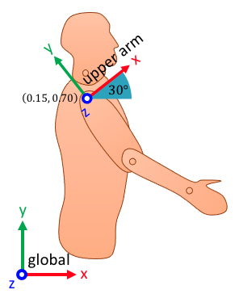
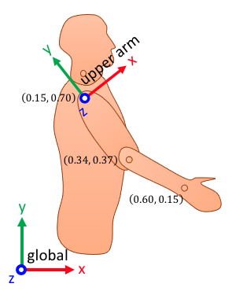
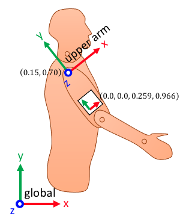

---
jupytext:
  text_representation:
    extension: .md
    format_name: myst
    format_version: 0.13
    jupytext_version: 1.16.6
kernelspec:
  display_name: Python 3 (ipykernel)
  language: python
  name: python3
---

# Creating transform series

A series of N transforms has a shape of (N, 4, 4):

    [
        [
            [R00(t0), R01(t0), R02(t0), px(t0)],
            [R10(t0), R11(t0), R12(t0), py(t0)],
            [R20(t0), R21(t0), R22(t0), pz(t0)],
            [    0.0,     0.0,     0.0,    1.0],
        ],
        [
            [R00(t1), R01(t1), R02(t1), px(t1)],
            [R10(t1), R11(t1), R12(t1), py(t1)],
            [R20(t1), R21(t1), R22(t1), pz(t1)],
            [    0.0,     0.0,     0.0,    1.0],
        ],
        ...
    ]

The function [ktk.geometry.create_transform_series](api/ktk.geometry.create_transform_series.rst) can create transforms using multiple input forms.

In the following sections, we will cover how to create a transform that expresses the position and orientation of the upper-arm coordinate system using different inputs.

## Using rotation angles

We use this method when we already know the orientation angles. Real-life cases include expressing coordinate systems for an inclined surface, a turning wheel, etc.

:::{figure-md} fig_geometry_create_transform_series_angles
:width: 3in


Creating transforms using rotation angles.
:::

In this case, pictured in {numref}`fig_geometry_create_transform_series_angles`, we create a transform based on a rotation of 30° around the z axis:

```{code-cell} ipython3
import kineticstoolkit.lab as ktk

ktk.geometry.create_transform_series(
    angles=[30], seq="z", degrees=True, positions=[[0.15, 0.70, 0.0]]
)
```

We can also combine multiple rotations around multiple axes. For instance, for a rotation of 30° around z, followed by a rotation of 10° around x, followed by a rotation of 20° around y, we would use:

```{code-cell} ipython3
ktk.geometry.create_transform_series(
    angles=[[30.0, 10.0, 20.0]], seq="zxy", degrees=True
)
```

3D rotations will be discussed later in section [](geometry_angles.md) along with the importance of the rotation order.

## Using points (e.g. reflective markers)

We use this method to create transforms based on known positions such as markers affixed on bony landmarks as pictured in {numref}`fig_geometry_create_transform_series_points`.

In this case, we know the position of the shoulder, elbow, and wrist. We want to create a transform that has its y axis aligned with the shoulder-elbow line, and its z axis perpendicular to the shoulder-elbow-wrist plane.

:::{figure-md} fig_geometry_create_transform_series_points
:width: 3in


Creating transforms using points.
:::

We start by creating point series for the three markers. In a real-case scenario, this could be the trajectory of markers as read from a c3d file.

```{code-cell} ipython3
shoulder = ktk.geometry.create_point_series([[0.15, 0.70]])
elbow = ktk.geometry.create_point_series([[0.34, 0.37]])
wrist = ktk.geometry.create_point_series([[0.60, 0.15]])

print(f"Shoulder: {shoulder}")
print(f"Elbow: {elbow}")
print(f"Wrist: {wrist}")
```

The transform is then created using:

```{code-cell} ipython3
ktk.geometry.create_transform_series(
    y=shoulder - elbow,  # Direction of the y axis
    xy=wrist - elbow,  # Another vector in the xy plane, oriented ~toward z
    positions=shoulder,  # Origin
)
```

## Using quaternions (e.g., IMUs)

We use this method to create transforms based on the known 3D orientation of rigid bodies in space, expressed as quaternions. While a 3D rotation matrix requires nine numbers, a quaternion only requires four. It is therefore a more efficient way to express 3D rotations.

Due to this more efficient representation of the same operation, measurement systems often use this representation to communicate 3D orientations. This is the case with inertial measurement units (IMUs), and with rigid body orientations measured by optoelectronic systems such as Vicon (Tracker) or Optitrack (Motive).

:::{figure-md} fig_geometry_create_transform_series_quaternions
:width: 3in


Creating transforms using quaternions.
:::

In this case, which is pictured in {numref}`fig_geometry_create_transform_series`(c), the orientation of the arm's coordinate system is given by quaternion [0.0, 0.0, 0.259, 0.966]. To convert this quaternion and the position of the shoulder to its transform equivalent:

```{code-cell} ipython3
ktk.geometry.create_transform_series(
    quaternions=[[0.0, 0.0, 0.259, 0.966]], positions=[[0.15, 0.7]]
)
```
