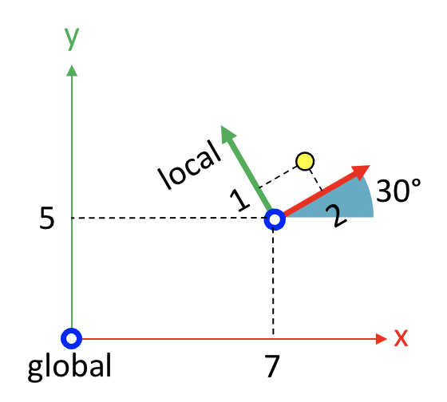

---
jupytext:
  text_representation:
    extension: .md
    format_name: myst
    format_version: 0.13
    jupytext_version: 1.14.0
kernelspec:
  display_name: Python 3 (ipykernel)
  language: python
  name: python3
---

```{code-cell} ipython3
:tags: [remove-cell]

%matplotlib inline
```

# 📖 The homogeneous transform: mapping coordinates to other coordinate systems

:::{card} Summary
This section shows the role of the homogeneous transform in moving from local to global coordinates, and how to perform these operations in Kinetics Toolkit using [](api/ktk.geometry.get_global_coordinates.rst) and [](api/ktk.geometry.get_local_coordinates.rst).
:::


In section [](geometry_basics.md), we learned the frame, which is a 4x4 matrix that defines the **position and orientation of a coordinate system, in respect to a reference coordinate system.**

In section [](geometry_transform_changing_coordinate_system.md), we learned that the same 4x4 matrix can also be defined as a **translation and rotation of a point, vector, or frame.**

In this new section, we will use both definitions to see the third and last role of the homogeneous transform, which is **remapping points, vectors and frames from a given coordinate system to another coordinate system.**


## 📄 Mapping local coordinates to global coordinates

Let's start with this example, where we want to express the yellow point in global coordinates.



*Figure 1. Expressing a local point in global coordinates.*

The unknown is the yellow point's coordinates in respect to the global frame:

$$
^\text{global}p = \text{?}
$$

Instead of considering point $p$ as a point in its own local coordinate system, let's imagine that it was first expressed in the global reference frame ($^\text{global} p_\text{initial}$). Then, it was rotated by 30 degrees around the origin, then translated by (7, 5, 0) to reach its final position ($^\text{global} p_\text{transformed}$):


*Figure 2. Transformation sequence from local coordinates to global coordinates.*

This operation is expressed by:

$$
^\text{global} p_\text{transformed}
~~~ =
~~~ T
~~~ ^\text{global}p_\text{initial}
$$

These two ways of seing this problem are completely equivalent:

| Local point in global coordinates (Fig. 1)                                  | Rotating/translating a point (Fig. 2)                                            |
| :-------------------------------------------------------------------------: | :------------------------------------------------------------------------------: |
| $^\text{global}p ~~~ = ~~~ ^\text{global}_\text{local}T ~~~ ^\text{local}p$ | $^\text{global} p_\text{transformed} = ~~~ T ~~~ ^\text{global}p_\text{initial}$ |
| $^\text{global}p$                                                           | $^\text{global} p_\text{transformed}$                                            |
| $^\text{global}_\text{local}T$                                              | $T$                                                                              |
| $^\text{local}p$                                                            | $^\text{global}p_\text{initial}$                                                 |


See how the left equation allows passing from local coordinates to global coordinates!

We know the yellow point's coordinate (2, 1, 0) in respect to the local frame:

$$
^\text{local}p = \begin{bmatrix}
2 \\ 1 \\ 0 \\ 1
\end{bmatrix}
$$

We also know how to express the local frame:

$$
~^\text{global}_\text{local}T = \begin{bmatrix}
\cos(30) & -\sin(30) & 0 & 7 \\
\sin(30) & \cos(30) & 0 & 5 \\
0 & 0 & 1 & 0 \\
0 & 0 & 0 & 1
\end{bmatrix}
$$

Therefore:

$$
^\text{global}p
=
\begin{bmatrix}
\cos(30) & -\sin(30) & 0 & 7 \\
\sin(30) & \cos(30) & 0 & 5 \\
0 & 0 & 1 & 0 \\
0 & 0 & 0 & 1
\end{bmatrix}
\begin{bmatrix}
2 \\ 1 \\ 0 \\ 1
\end{bmatrix}
\\ =
\begin{bmatrix}
0.866 & -0.5 & 0 & 7 \\
0.5 & 0.866 & 0 & 5 \\
0 & 0 & 1 & 0 \\
0 & 0 & 0 & 1
\end{bmatrix}
\begin{bmatrix}
2 \\ 1 \\ 0 \\ 1
\end{bmatrix}
=
\begin{bmatrix}
8.232 \\ 6.866 \\ 0 \\ 1
\end{bmatrix}
$$

The position of the yellow points, in global coordinates, is (8.232, 6.866, 0).

## 📄 Mapping global coordinates to local coordinates

Since we get global coordinates using:

$$
^\text{global}p 
~~~ =
~~~ ^\text{global}_\text{local}T
~~~ ^\text{local}p 
$$

then the reverse transform is literally the inverse of the homogeneous matrix:

$$
^\text{global}_\text{local}T^{-1}
~~~ ^\text{global}p 
~~~ =
~~~ ^\text{global}_\text{local}T^{-1}
~~~ ^\text{global}_\text{local}T
~~~ ^\text{local}p 
\\=
~~~ ^\text{local}p 
$$


## 📄 Application to our example

This ability of switching between coordinate systems is very powerful. Let's get back to our initial pose.


*Figure 3. Expressing the position and orientation of the upper arm.*

Using this information:
1. the length of the upper arm is 38 cm;
2. the shoulder is located 15 cm forward and 70 cm upward to the global origin;
3. the upper arm is inclined at 30 degrees of the vertical.

We want to know the position of the elbow in global coordinates.

**Solution:**

The first information allows us to express the position of the elbow in the local upper arm coordinate system:

$$
~^\text{upper arm}p_\text{elbow} = \begin{bmatrix}
0 \\ -0.38 \\ 0 \\ 1
\end{bmatrix}
$$

The second and third informations allow us to express the upper arm frame:

$$
~^\text{global}_\text{upper arm}T = \begin{bmatrix}
\cos(30) & -\sin(30) & 0 & 0.15 \\
\sin(30) & \cos(30) & 0 & 0.7 \\
0 & 0 & 1 & 0 \\
0 & 0 & 0 & 1
\end{bmatrix} \\=
\begin{bmatrix}
0.866 & -0.5 & 0 & 0.15 \\
0.5 & 0.866 & 0 & 0.7 \\
0 & 0 & 1 & 0 \\
0 & 0 & 0 & 1
\end{bmatrix}
$$

Therefore, the position of the elbow in the global coordinate system is:

$$
^\text{global}p_\text{elbow}
~~~=
~~~^\text{global}_\text{upper arm}T
~~~^\text{upper arm}p_\text{elbow}
$$

$$
^\text{global}p_\text{elbow}
\\=
\begin{bmatrix}
0.866 & -0.5 & 0 & 0.15 \\
0.5 & 0.866 & 0 & 0.7 \\
0 & 0 & 1 & 0 \\
0 & 0 & 0 & 1
\end{bmatrix}
\begin{bmatrix}
0 \\ -0.38 \\ 0 \\ 1
\end{bmatrix} \\=
\begin{bmatrix}
0.34 \\ 0.371 \\ 0 \\ 1
\end{bmatrix}
$$

Its final coordinates are $(0.34, 0.371, 0)$.

## 📄 Changing coordinate systems using Kinetics Toolkit

Using the [](api/ktk.geometry.create_transforms.rst) and [](api/ktk.geometry.matmul.rst) functions introduced in the previous section, we can solve this problem following:

```{code-cell} ipython3
import kineticstoolkit.lab as ktk

T = ktk.geometry.create_transforms(
    seq="z", angles=[30], translations=[[0.15, 0.7, 0]], degrees=True
)

local_p_elbow = [[0, -0.38, 0, 1]]

global_p_elbow = ktk.geometry.matmul(T, local_p_elbow)

global_p_elbow
```

However, Kinetics Toolkit also provides the functions [](api/ktk.geometry.get_global_coordinates.rst) and [](api/ktk.geometry.get_local_coordinates.rst) to quickly change from one coordinate system to another. While these functions are only shortcuts to invert and multiply matrices, they switch between coordinate systems in a way that may be easier to remember:
```{code-cell} ipython3
global_p_elbow = ktk.geometry.get_global_coordinates(
    local_coordinates=local_p_elbow, reference_frames=T
)

global_p_elbow
```

```{code-cell} ipython3
local_p_elbow = ktk.geometry.get_local_coordinates(
    global_coordinates=global_p_elbow, reference_frames=T
)

local_p_elbow
```
