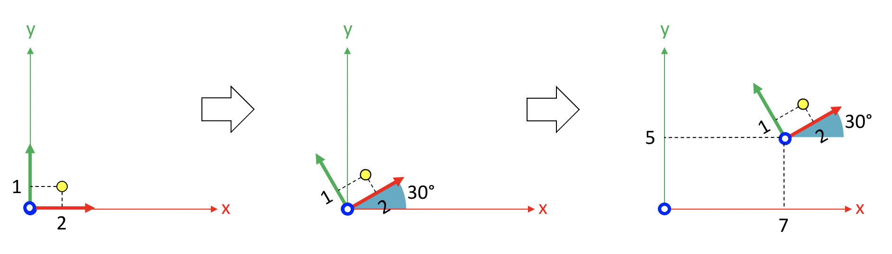

# Mapping local coordinates to global coordinates

Let's start with this example, where we want to express the yellow point of {numref}`fig_geometry_change_coordinate_system` in global coordinates.

```{figure-md} fig_geometry_change_coordinate_system
:width: 4in


Expressing a local point in global coordinates.
```

The unknown is the yellow point's coordinates in respect to the global frame:

$$
^\text{global} p = \text{?}
$$ (eq_geometry_transform_unkown)

Instead of considering point $p$ as a point in its own local coordinate system, let's imagine that it was first expressed in the global reference frame ($^\text{global} p_\text{initial}$). Then, it was rotated by 30 degrees around the origin, then translated by (7, 5, 0) to reach its final position ($^\text{global} p_\text{transformed}$), as shown in {numref}`fig_geometry_transformation_sequence`.


```{figure-md} fig_geometry_transformation_sequence
:width: 8in


Transformation sequence from local coordinates to global coordinates.
```

This operation is expressed by:

$$
^\text{global} p_\text{transformed}
~~~ =
~~~ T
~~~ ^\text{global} p_\text{initial}
$$ (eq_geometry_transform_transformation)

where $T$ represents a rotation of 30 degrees and a translation of (7, 5, 0) units.

Now, let's put {numref}`fig_geometry_change_coordinate_system` and {numref}`fig_geometry_transformation_sequence` in relation.

The first image of {numref}`fig_geometry_transformation_sequence` expresses the yellow point in its local reference frame. Therefore:

$$
^\text{global} p_\text{initial} = ^\text{local} p
$$ (eq_geometry_localp_equivalence)

The last image of {numref}`fig_geometry_transformation_sequence` expresses the yellow point in global coordinates. Therefore:

$$
^\text{global} p_\text{transformed} = ^\text{global} p
$$ (eq_geometry_globalp_equivalence)

By substituting {eq}`eq_geometry_localp_equivalence` and {eq}`eq_geometry_globalp_equivalence` into {eq}`eq_geometry_transform_transformation`, we get:

$$
^\text{global} p = T ~~~ ^\text{local} p
$$

where T, which was formerly interpreted as the transformation applied in {numref}`fig_geometry_transformation_sequence`, is now interpreted as the local reference frame itself: a coordinate system that has been rotated by 30 degrees and translated by (7, 5, 0) units.

We see that if we know the local coordinates of a point $^\text{local} p$, and we know the coordinates of its local reference frame $T$, then the global coordinates of the point are obtained simply by multiplying $T$ and $^\text{local} p$.

Now, let's solve the problem. We know the yellow point's coordinate (2, 1, 0) in respect to the local frame:

$$
^\text{local}p = \begin{bmatrix}
2 \\ 1 \\ 0 \\ 1
\end{bmatrix}
$$

We also know how to express the local frame:

$$
~^\text{global}_\text{local}T = \begin{bmatrix}
\cos(30) & -\sin(30) & 0 & 7 \\
\sin(30) & \cos(30) & 0 & 5 \\
0 & 0 & 1 & 0 \\
0 & 0 & 0 & 1
\end{bmatrix}
$$

Therefore:

$$
^\text{global}p
=
\begin{bmatrix}
\cos(30) & -\sin(30) & 0 & 7 \\
\sin(30) & \cos(30) & 0 & 5 \\
0 & 0 & 1 & 0 \\
0 & 0 & 0 & 1
\end{bmatrix}
\begin{bmatrix}
2 \\ 1 \\ 0 \\ 1
\end{bmatrix}
\\=
\begin{bmatrix}
0.866 & -0.5 & 0 & 7 \\
0.5 & 0.866 & 0 & 5 \\
0 & 0 & 1 & 0 \\
0 & 0 & 0 & 1
\end{bmatrix}
\begin{bmatrix}
2 \\ 1 \\ 0 \\ 1
\end{bmatrix}
=
\begin{bmatrix}
8.232 \\ 6.866 \\ 0 \\ 1
\end{bmatrix}
$$

The position of the yellow points, in global coordinates, is (8.232, 6.866, 0).
