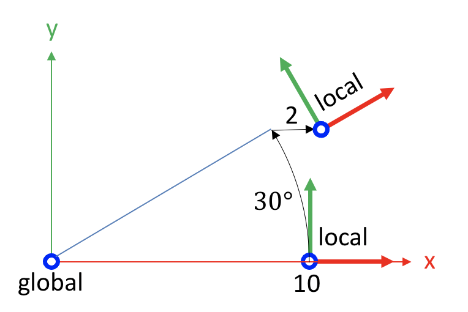

---
jupytext:
  text_representation:
    extension: .md
    format_name: myst
    format_version: 0.13
    jupytext_version: 1.14.0
kernelspec:
  display_name: Python 3 (ipykernel)
  language: python
  name: python3
---

```{code-cell} ipython3
:tags: [remove-cell]

%matplotlib inline
```

# 📖 The homogeneous transform: rotating and translating coordinates

:::{card} Summary
This section defines the 4x4 homogeneous transform, shows how to use it to rotate and translate points, vectors and frames, and how to generate and use series of homogeneous transforms in Kinetics Toolkit using [](api/ktk.geometry.create_transforms.rst) and [](api/ktk.geometry.matmul.rst).
:::

In the previous section, we learned how to construct a frame: a 4x4 matrix that represents the position and orientation of a local coordinate system in respect to a reference coordinate system.

We learned that a frame always has this form:

$$
\begin{bmatrix}
R_{11} & R_{12} & R_{13} & P_x \\
R_{21} & R_{22} & R_{23} & P_y \\
R_{31} & R_{32} & R_{33} & P_z \\
0      & 0      & 0      & 1
\end{bmatrix}
$$

where:

- the $R$ sub-matrix is a function of three rotation angles and represents the orientation of the local coordinate system;
- the $P$ vector is the position of the local coordinate system's origin.

In addition to represent positions and orientations, the same matrix can also be represent rigid transformations such as translations and rotations. In this case, this matrix is called a **homogeneous transform**, and:

- the $R$ sub-matrix represents a rotation;
- the $P$ vector is a translation.

Any coordinate (point, vector or frame) that is multiplied by the homogeneous transform will be rotated by $R$ and translated by $P$:

$$
^\text{global} p_{\text{tranformed}} ~~~ = ~~~ T ~~~ ^\text{global} p_\text{initial}
$$

The following examples show how a same homogeneous transform can move either points, vectors or frames.

## ⚙️ Example 1: moving points

Let say we want to rotate the point located at (10, 0, 0) by 30 degrees around the origin's z axis, then translate it 2 units to the right:


*Figure 1. Rotating and translating a point in respect to the global reference frame.*

We first express the original coordinates of the point:

$$
^\text{global} p_\text{initial} =
\begin{bmatrix}
10 \\ 0 \\ 0 \\ 1
\end{bmatrix}
$$

We then express the rotation and translation that we want to apply to this point:

$$
T =
\begin{bmatrix}
\cos(30) & -\sin(30) & 0 & 2 \\
\sin(30) & \cos(30) & 0 & 0 \\
0 & 0 & 1 & 0 \\
0 & 0 & 0 & 1
\end{bmatrix}
$$

We multiply the position to the transform to obtain the final position of the point:

$$
^\text{global} p_{\text{tranformed}} =
\begin{bmatrix}
\cos(30) & -\sin(30) & 0 & 2 \\
\sin(30) & \cos(30) & 0 & 0 \\
0 & 0 & 1 & 0 \\
0 & 0 & 0 & 1
\end{bmatrix}
\begin{bmatrix} 10 \\ 0 \\ 0 \\ 1 \end{bmatrix} \\ =
\begin{bmatrix} 10\cos(30) + 2 \\ 10\sin(30) \\ 0 \\ 1 \end{bmatrix} =
\begin{bmatrix} 10.66 \\ 5 \\ 0 \\ 1 \end{bmatrix}
$$

The final coordinates of the points are (10.66, 5, 0).

## ⚙️ Example 2: rotating vectors

For this second example, let's apply this same transform to a vector of 10 units toward de x axis (10, 0, 0).


*Figure 2. Rotating a vector in respect to the global reference frame.*

The same equation applies:

$$
^\text{global} \vec{v}_{\text{tranformed}} ~~~ = ~~~ T ~~~ ^\text{global} \vec{v}_\text{initial}
$$

Although vector $\vec{v}_\text{initial}$ shares the same coordinates as $p_\text{initial}$ in the previous example, its written differently (with a 0 instead of a 1 on the fourth coordinate). This is because the fourth element is responsible for translations, and contrarily to a point, a vector cannot be translated.

$$
^\text{global} \vec{v}_\text{initial} =
\begin{bmatrix}
10 \\ 0 \\ 0 \\ 0
\end{bmatrix}
$$

We multiply this vector by the transform to obtain the final vector:

$$
^\text{global} \vec{v}_{\text{tranformed}} =
\begin{bmatrix}
\cos(30) & -\sin(30) & 0 & 2 \\
\sin(30) & \cos(30) & 0 & 0 \\
0 & 0 & 1 & 0 \\
0 & 0 & 0 & 1
\end{bmatrix}
\begin{bmatrix} 10 \\ 0 \\ 0 \\ 0 \end{bmatrix} \\ =
\begin{bmatrix} 10\cos(30) \\ 10\sin(30) \\ 0 \\ 0 \end{bmatrix} =
\begin{bmatrix} 8.66 \\ 5 \\ 0 \\ 0 \end{bmatrix}
$$

The final coordinates of the vector are (8.66, 5, 0).


## ⚙️ Example 3: moving frames

If we get back to the definition of a frame, we remind that the first three columns are three vectors (the direction of three axes), and the fourth column is a point (the position of the origin). Therefore, since an homogeneous transform can move both points and vectors, then it can also move complete frames.



*Figure 3. Rotating and translating a local frame in respect to the global reference frame.*


Let's use the same homogeneous transform to rotate and translate the frame  $^\text{global} _\text{local-initial} F$ (which reads as *Frame 'local' in its initial pose, expressed in global coordinates*).

$$
^\text{global} _\text{local-tranformed} F ~~~ = ~~~ T ~~~ ^\text{global} _\text{local-initial} F
$$

We first express the unrotated frame $^\text{global} _\text{local-initial} F$:

$$
^\text{global} _\text{local-initial} F
=
\begin{bmatrix}
\cos(0) & -\sin(0) & 0 & 10 \\
\sin(0) & \cos(0) & 0 & 0 \\
0 & 0 & 1 & 0 \\
0 & 0 & 0 & 1
\end{bmatrix}
=
\begin{bmatrix}
1 & 0 & 0 & 10 \\
0 & 1 & 0 & 0 \\
0 & 0 & 1 & 0 \\
0 & 0 & 0 & 1
\end{bmatrix}
$$

The transformed frame is calculated using:

$$
^\text{global} _\text{local-transformed} F
=
\begin{bmatrix}
\cos(30) & -\sin(30) & 0 & 2 \\
\sin(30) & \cos(30) & 0 & 0 \\
0 & 0 & 1 & 0 \\
0 & 0 & 0 & 1
\end{bmatrix}
\begin{bmatrix}
1 & 0 & 0 & 10 \\
0 & 1 & 0 & 0 \\
0 & 0 & 1 & 0 \\
0 & 0 & 0 & 1
\end{bmatrix}
\\=
\begin{bmatrix}
\cos(30) & -\sin(30) & 0 & 10.66 \\
\sin(30) & \cos(30) & 0 & 5 \\
0 & 0 & 1 & 0 \\
0 & 0 & 0 & 1
\end{bmatrix}
$$

## 📄 Rotating and translating coordinates using Kinetics Toolkit

The function [](api/ktk.geometry.create_transforms.rst) creates series of homogeneous transforms based on angles and translations. For instance, the transform $T$ used in this section can be created using:

```{code-cell} ipython3
import kineticstoolkit.lab as ktk

T = ktk.geometry.create_transforms(
    seq="z",  # Which means a rotation around the z axis
    angles=[30],
    translations=[[2, 0, 0]],
    degrees=True,
)

T
```

:::{caution}
Note that the `angles` and `translations` values are enclosed in bracket. Similarly, the return transformed $T$ is also enclosed in an additional first dimension. This is because all functions in the [](api/ktk.geometry.rst) module work on series of data, and the first dimensions is always reserved to time. Please consult [this section](geometry_dimension_conventions.md) for more information.
:::

The function [](api/ktk.geometry.matmul.rst) performs matrix multiplications on data series. It can therefore be used to obtain the solution to the three previous examples.

```{code-cell} ipython3
# Transformed point

ktk.geometry.matmul(T, [[10, 0, 0, 1]])
```

```{code-cell} ipython3
# Transformed vector

ktk.geometry.matmul(T, [[10, 0, 0, 0]])
```

```{code-cell} ipython3
# Transformed frame

ktk.geometry.matmul(
    T, [[[1, 0, 0, 10], [0, 1, 0, 0], [0, 0, 1, 0], [0, 0, 0, 1]]]
)
```
