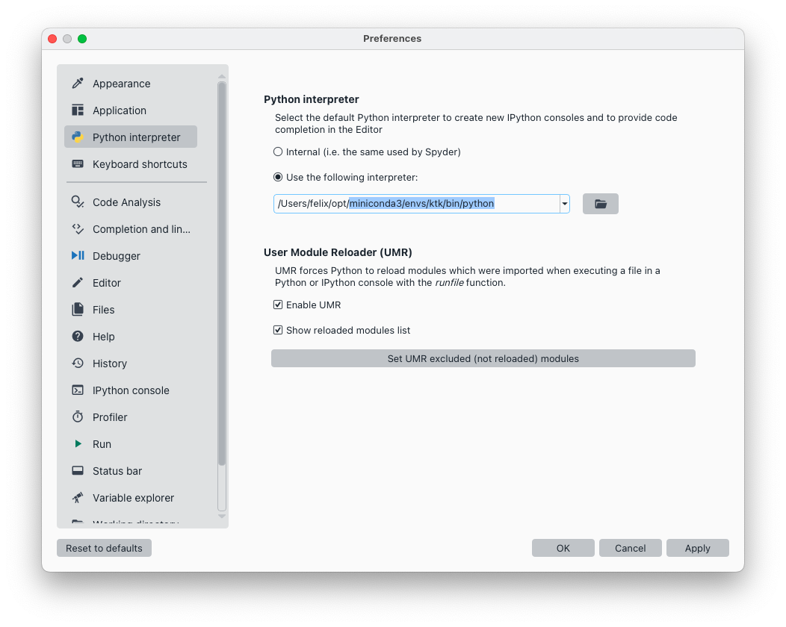

# Installing and configuring Spyder

Spyder is a general-purpose programming environment for scientific applications, and it suits biomechanical data processing very well. Therefore, this is the programming environment that we recommend in this guide. Here is how to install and configure it to enhance your experience with interactive data processing.


```{figure-md} fig_spyder_ide
:width: 4in


The Scientific Python Development Environment (spyder)
```

## Installation

Download and install Spyder from its website: https://www.spyder-ide.org

## Configuration

### Selecting your Python installation

In section [](getting_started_installing.md), we created a `ktk` conda environment. We now need to configure Spyder to use this environment, as shown in {numref}`fig_spyder_python_interpreter`.

- Go to the Spyder's preferences
- Navigate to the **Python interpreter** item
- Check "Use the following interpreter"
- Click the "open" button, navigate to the folder "miniconda3/envs/ktk/bin", and select "python".

```{figure-md} fig_spyder_python_interpreter
:width: 7in



Selecting the correct Python installation in Spyder
```


### Interactive Matplotlib figures

To pan and zoom plots, or to use Kinetics Toolkit's interactive functions (e.g., editing events, visualizing 3D points), you must use an interactive frontend for Matplotlib. Follow these steps to configure Spyder for interactive graphics, as shown in {numref}`fig_spyder_qt5`.

- Go to the Spyder's preferences
- Navigate to the **IPython console** item
- Navigate to the **Graphics** pane.
- In the **Graphics backend** box, select **Qt5**.


```{figure-md} fig_spyder_qt5
:width: 7in


Enabling interactive graphics in Spyder
```

:::{note}

If you use an IPython-based console other than Spyder's, or you do not want to change this Spyder configuration, you can enable interactive graphics temporarily by typing:

```
%matplotlib qt5
```

:::


:::{important}
It is recommended to restart Spyder after changing all these settings.
:::
