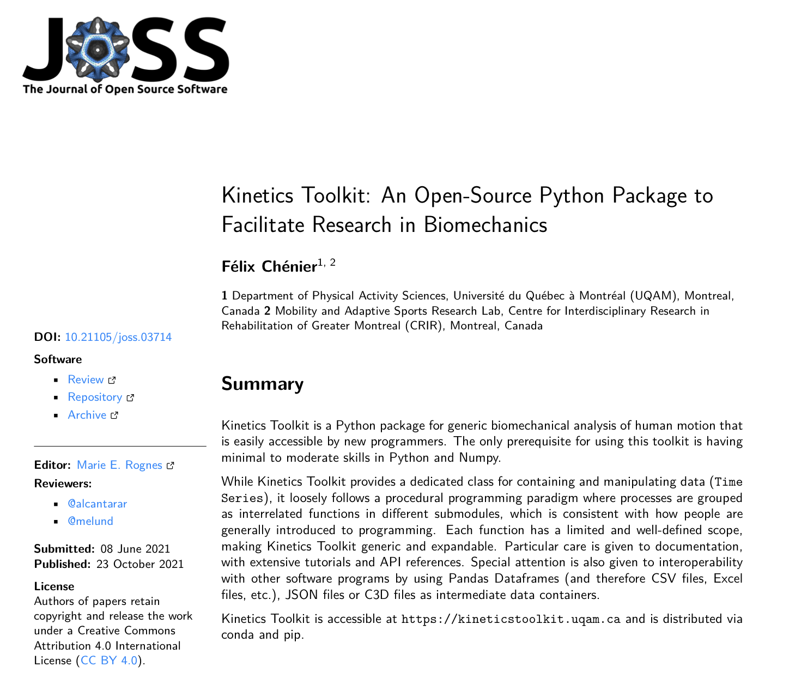

# Importing Kinetics Toolkit

Now that we learned how to use Python, Numpy and Matplotlib to perform simple biomechanical analyses, we can go further with more complex analyses using the `kineticstoolkit` Python package. This package provides functions and classes to express and manipulate time series data (resampling, segmenting using events, synchronizing different instruments, filtering data), performing geometrical operations, visualizing kinematic data interactively, tracking markers and rigid bodies, etc.

```{figure-md} fig_joss
:width: 6in


[Kinetics Toolkit, Journal of Open Source Software](https://joss.theoj.org/papers/10.21105/joss.03714)
```

:::{note}
Please note that before continuing in this part, you must have basic to moderate understanding of Python, NumPy and Matplotlib, and you must have a working Python environment with the `kineticstoolkit` module installed. If this is not the case, please [get started here](getting_started.md).
:::

You can import the `kineticstoolkit` module using two methods:

- Standard: `import kineticstoolkit as ktk`
- Lab mode: `import kineticstoolkit.lab as ktk`

:::{note}
The first import can take several seconds; subsequent imports are much faster.
:::

Lab mode is a convenience tool that sets some defaults for a more enjoyable data processing session in IPython-based environments such as Spyder. It automatically imports all installed [Kinetics Toolkit extensions](extensions.md), makes cosmetics changes to the representations (repr) of dictionaries, arrays and warnings, and improves Matplotlib defaults colours and sizes for interactive biomechanics work. See [ktk.import_extensions](api/ktk.import_extensions.rst) and [ktk.change_defaults](api/ktk.change_defaults.rst) for more information. All tutorials in this book use this mode.

```
import kineticstoolkit.lab as ktk
```

is equivalent to:
```
import kineticstoolkit as ktk
ktk.import_extensions()
ktk.change_defaults()
```
