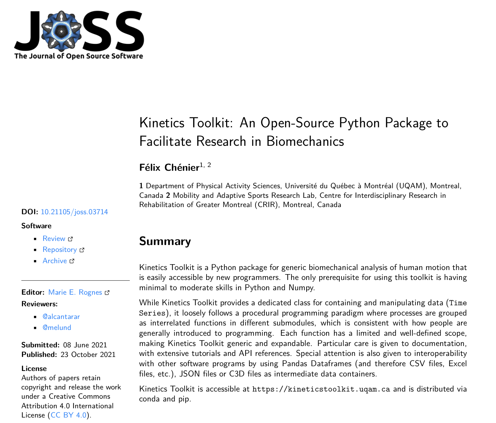

# Importing Kinetics Toolkit

Now that we have learned how to use Python, Numpy, and Matplotlib to perform simple biomechanical analyses, we can go further with more complex analyses using the `kineticstoolkit` Python package.


Kinetics Toolkit is an open-source Python package to facilitate research in biomechanics. It provides tools for:
- [Analyzing timeseries](timeseries.md), including [data](timeseries_data_management.md), [time](timeseries_time_management.md) and [event](timeseries_event_management.md) management, [time-domain and frequency-domain noise filtering](filters.md), and [cycle management](cycles.md);
- [Managing files](files.md), including reading/writing C3D, CSV and any file supported by {{pandas}};
- [Performing rigid body geometry operations](geometry.md), including manipulation of series of [points, vectors](geometry_points_vectors.md), [frames](geometry_transforms.md) and [homogeneous transforms](geometry_transform_moving_coordinates.md), [coordinate system changes](geometry_transform_changing_coordinate_system.md), and [3D angle extraction](geometry_angles.md);
- [Visualizing 3D points and frames interactively](player.md);
- [Performing kinematic operations](kinematics.md) such as reconstructing [occluded](kinematics_reconstructing_occluded_markers.md), [removed](kinematics_reconstructing_removed_markers.md) or [probed](kinematics_reconstructing_probed_points.md) markers;
- And more using [extensions](extensions.md).


```{figure-md} fig_joss
:width: 6in


[Kinetics Toolkit, Journal of Open Source Software](https://joss.theoj.org/papers/10.21105/joss.03714)
```

:::{note}
Please note that before continuing in this part, you must have a basic to moderate understanding of Python, NumPy, and Matplotlib, and you must have a working Python environment with the `kineticstoolkit` module installed. If this is not the case, please [get started here](getting_started.md).
:::

You can import the `kineticstoolkit` module using two methods:

- Standard: `import kineticstoolkit as ktk`
- Lab mode: `import kineticstoolkit.lab as ktk`

:::{note}
The first import can take several seconds; subsequent imports are much faster.
:::

Lab mode is a convenience tool that sets some defaults for a more enjoyable data processing session in IPython-based environments such as Spyder. It makes cosmetic changes to the representations (repr) of dictionaries, arrays, and warnings, and improves Matplotlib default colours and sizes for interactive biomechanics work. See [ktk.change_defaults](api/ktk.change_defaults.rst) for more information. All tutorials in this book use this mode.

```
import kineticstoolkit.lab as ktk
```

is equivalent to:
```
import kineticstoolkit as ktk
ktk.change_defaults()
```
