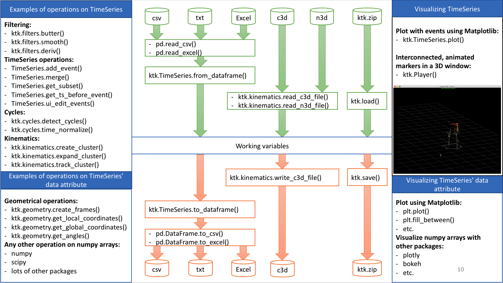

# Integrating Kinetics Toolkit in your workflow

{{ incomplete }}

Kinetics Toolkit is designed to play well with other softwares and packages, to be used as an addition and not as a replacement to existing workflows. Most of the processing is done via the [TimeSeries](api/kineticstoolkit.TimeSeries.rst) class, which is simply a container time and data expressed as numpy ndarrays. This [tutorial](timeseries.md) on TimeSeries will help to understand this class and its associated methods.

Kinetics Toolkit does not ties to specific instruments. Using your recording instrumentation, you need to get your data in a compatible file, be it very generic such as csv or txt files, or more specialized such as c3d.

To import tabular data such as csv, txt or Excel files, you will first use the [Pandas](https://pandas.pydata.org/) package to open the data in a DataFrame format. Then, you can import the DataFrame as a TimeSeries using [TimeSeries.from_dataframe()](api/kineticstoolkit.TimeSeries.from_dataframe.rst). This [tutorial](timeseries_dataframes.md) shows such an example.

To import motion data from a c3d or n3d file, you will directly use the [ktk.kinematics.read_c3d_file()](api/kineticstoolkit.kinematics.read_c3d_file.rst) or [ktk.kinematics.read_n3d_file()](api/kineticstoolkit.kinematics.read_n3d_file.rst) function, which automatically creates a TimeSeries.

:::{note}
To use [ktk.kinematics.read_c3d_file()](api/kineticstoolkit.kinematics.read_c3d_file.rst), you must have installed Kinetics Toolkit from conda-forge, or installed the [ezc3d](https://github.com/pyomeca/ezc3d) package manually (this package is not available via pip).
:::

You can also export TimeSeries to these file formats, using similar methods. These import/export methods also make it possible to integrate Kinetics Toolkit with other data processing software.

In addition to importing and exporting, Kinetics Toolkit offer [ktk.load()](api/kineticstoolkit.load.rst) and [ktk.save()](api/kineticstoolkit.save.rst) functions that store every standard python types, numpy's ndarray, pandas's DataFrame and Series, and ktk's TimeSeries, in a portable zipped JSON format. See this [tutorial](loadsave.md) for more information on these functions.

Once your data is available in a TimeSeries form, you can process it using either Kinetics Toolkit's modules directly on the TimeSeries, or using numpy/scipy functions on the TimeSeries' data attribute, which are standard numpy arrays.

The following figure summarizes the data flow using Kinetics Toolkit:

