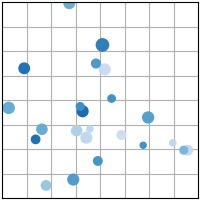
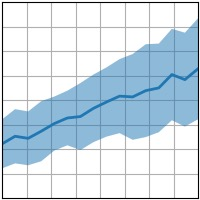
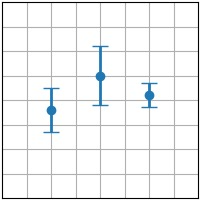

# Matplotlib

:::{sidebar}

:::

Matplotlib is a standard for producing high-quality and interactive figures. The pyplot module is highly similar to Matlab's plotting functions, and offers an easy to understand, yet very powerful way to produce figures.


Matplotlib can generate a high diversity of plots. Here are different examples that are relevant to biomechanics, directly reproduced from the {{matplotlib}} website:

|              {{plt_plot}}               |              {{plt_scatter}}               |              {{plt_fill_between}}               | 
|:---------------------------------------:|:------------------------------------------:|:-----------------------------------------------:|
|  |  |  |

|              {{plt_imshow}}               |              {{plt_errorbar}}               |              {{plt_bar}}               | 
|:-----------------------------------------:|:-------------------------------------------:|:--------------------------------------:|
|  |  |  |

This guide focuses uniquely on line plots using {{plt_plot}}. After learning it and [](numpy.md), any other type of plot will become relatively easy to draw just be reading their documentation.

```{tableofcontents}
```
