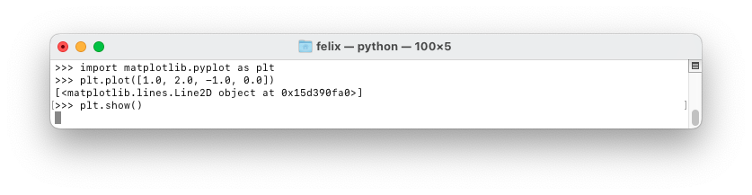
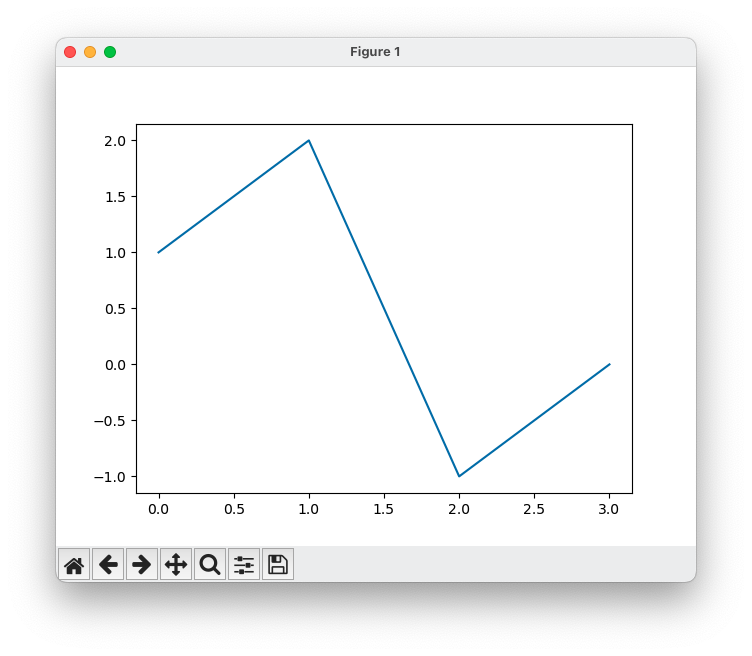

# Non-blocking, interactive Matplotlib figures

:::{card} Summary
This section illustrates how Matplotlib may behave differently on different computers and setups, and suggests a method to configure Spyder and Matplotlib to always generate non-blocking, interactive figures.
:::

## 📄 The problem with default settings

Matplotlib's behaviour can change between different Python environments. For instance, to plot a curve in the standard Python or IPython interpreter, we need to specify when to generate the figure using {{plt_show}}:




The different buttons on the figure allow some interaction with the plot:

-  Move the figure around (panning);
-  Zoom on the figure;
-  Undo the last pan/zoom operation;
-  Redo the last pan/zoom operation;
-  Reset to the initial pan/zoom;
-  Save the figure to an image file.

However, by default, the figure blocks console and we must close it before writing new code, which can be an inconvenience.

On the contrary, Spyder and Jupyter do not need `plt.show` and do not block the console.


However, by default, both Spyder and Jupyter generate static, non-interactive figures, that don't allow for zooming, panning, clicking, etc.

## 📄 Interactive figures

To get non-blocking **and** interactive figures in IPython-based environments such as IPython, Spyder and Jupyter, we need to specify an interactive frontend such as Qt5, which is often installed by default:

```
%matplotlib qt5
```

Subsequent calls of pyplot functions will happen in non-blocking, interactive windows:

```
plt.plot([1.0, 2.0, -1.0, -0.0])
```


Please consult section [](getting_started_configuring_spyder.md) to configure Spyder to use Qt5 by default, and therefore always get non-blocking, interactive figures.
