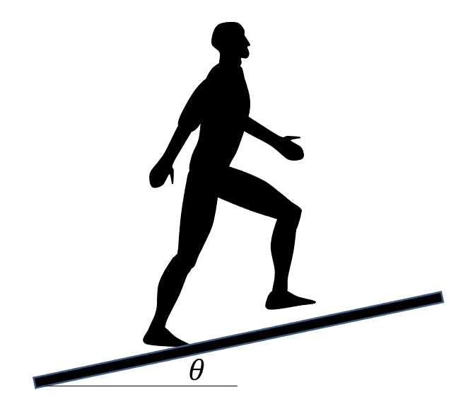

---
jupytext:
  text_representation:
    extension: .md
    format_name: myst
    format_version: 0.13
    jupytext_version: 1.14.0
kernelspec:
  display_name: Python 3 (ipykernel)
  language: python
  name: python3
---

```{code-cell} ipython3
:tags: [remove-cell]

%matplotlib inline
```

# Exercise: Trigonometry 2

When we walk on an inclined treadmill as in {numref}`fig_gait_inclined`, we must overcome a backward force equal to:

$$
F = m g \sin \theta
$$

where $m$ is the person's mass, $g$ is 9.81 m/s² and $\theta$ is the treadmill angle. Write a function names `plot_force` that takes the mass as an argument, and that plots $F$ for $\theta \in [-20, 20]$ degrees. Then, test your function for $m = 65$ kg.

```{figure-md} fig_gait_inclined
:width: 3.5in


Walking on an inclined surface.
```

```{code-cell} ipython3
:tags: [hide-cell]
import numpy as np
import matplotlib.pyplot as plt


def plot_force(m: float) -> None:
    """
    Plot the force a persons need to overcome on an inclined treadmill.

    Parameters
    ----------
    m :
        Mass of the person in kilograms

    Returns
    -------
    None

    """
    # First, let's define an angle array
    theta = np.linspace(-30, 30, 100, endpoint=False)

    # Calculate the force
    force = m * 9.81 * np.sin(np.deg2rad(theta))

    # Plot it
    plt.plot(theta, force)
    plt.xlabel("Angle (deg)")
    plt.ylabel("Force (N)")
    plt.show()


# Test the function
plot_force(65)
```
