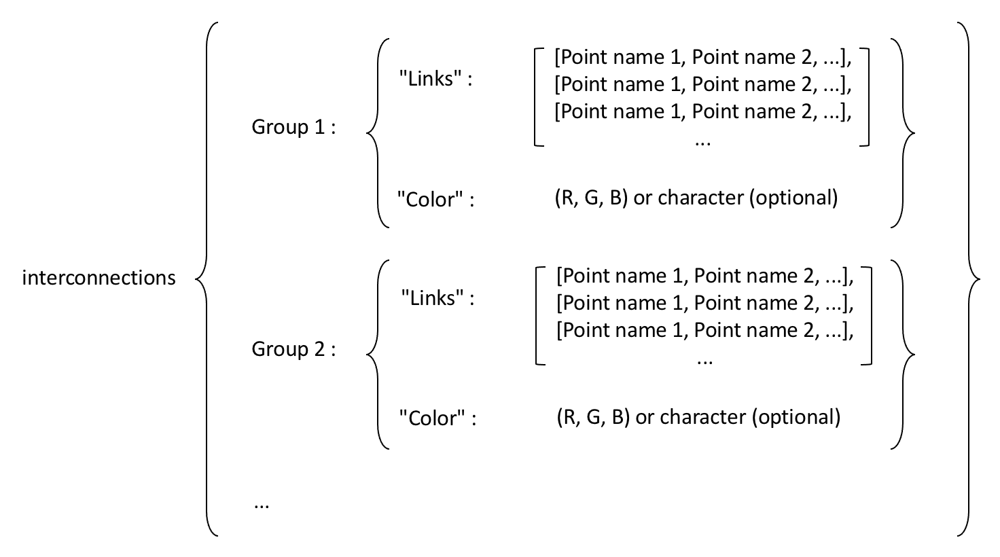

---
jupytext:
  text_representation:
    extension: .md
    format_name: myst
    format_version: 0.13
    jupytext_version: 1.16.4
kernelspec:
  display_name: Python 3 (ipykernel)
  language: python
  name: python3
---

```{code-cell} ipython3
:tags: [remove-cell]

%matplotlib qt5
```

# Interconnecting points

In the previous section, we learned how to show markers in the Player:

```{code-cell} ipython3
:tags: [remove-output]

import kineticstoolkit.lab as ktk

# Download and read markers from a sample C3D file
filename = ktk.doc.download("kinematics_tennis_serve_2players.c3d")
markers = ktk.read_c3d(filename)["Points"]
p = ktk.Player(markers, up="z", anterior="-y")
```

```{code-cell} ipython3
:tags: [remove-input]

p.set_contents(markers.get_ts_between_times(6, 8))
p._to_animation()
```

To interconnect points, we use the `interconnections` property of the Player, which is a dict that follows this form:

:::{figure-md} fig_player_interconnections
:width: 5in


Interconnection dictionary.
:::

For example, to interconnect Derrick's right lower limb, we would do:

```{code-cell} ipython3
# Name "RLowerLimb" is arbitrary, anything would do.
p.interconnections["RLowerLimb"] = {"Links": [
    ["Derrick:RTOE", "Derrick:RHEE", "Derrick:RANK", "Derrick:RTOE"], # Feet
    ["Derrick:RANK", "Derrick:RKNE"], # Shank
    ["Derrick:RKNE", "Derrick:RPSI", "Derrick:RASI", "Derrick:RKNE"]  # Thigh
]}  
```

```{code-cell} ipython3
:tags: [remove-input]

p._to_animation()
```

Let's assign a red colour to this side, and do the same in blue for the left side.

```{code-cell} ipython3
p.interconnections["RLowerLimb"]["Color"] = "r"
p.interconnections["LLowerLimb"] = {"Links": [
    ["Derrick:LTOE", "Derrick:LHEE", "Derrick:LANK", "Derrick:LTOE"], # Feet
    ["Derrick:LANK", "Derrick:LKNE"], # Shank
    ["Derrick:LKNE", "Derrick:LPSI", "Derrick:LASI", "Derrick:LKNE"]  # Thigh
], "Color": "b"}
```

```{code-cell} ipython3
:tags: [remove-input]

p._to_animation()
```

## Wildcards

To draw links for both Viktor and Derrick, we could repeat the same code by replacing every occurrence of "Derrick:" with "Viktor:". However, we can also use wildcards (`*`), which is much more convenient. A wildcard means "assign any name in place of `*`". We may choose to use wildcards as a prefix or as a suffix. Here, we use it as a prefix, for every body segment:

```{code-cell} ipython3
p.interconnections["LLowerLimb"] = {
    "Color": "b",
    "Links": [  # List of lines that span lists of markers
        ["*LTOE", "*LHEE", "*LANK", "*LTOE"],
        ["*LANK", "*LKNE"],
        ["*LKNE", "*LPSI", "*LASI", "*LKNE"],
    ],
}

p.interconnections["RLowerLimb"] = {
    "Color": "r",
    "Links": [
        ["*RTOE", "*RHEE", "*RANK", "*RTOE"],
        ["*RANK", "*RKNE"],
        ["*RKNE", "*RPSI", "*RASI", "*RKNE"],
    ],
}

p.interconnections["LUpperLimb"] = {
    "Color": (0.0, 0.5, 1.0),
    "Links": [
        ["*LSHO", "*LELB", "*LWRA", "*LFIN"],
        ["*LELB", "*LWRB", "*LFIN"],
        ["*LWRA", "*LWRB"],
    ],
}

p.interconnections["RUpperLimb"] = {
    "Color": (1.0, 0.5, 0.0),
    "Links": [
        ["*RSHO", "*RELB", "*RWRA", "*RFIN"],
        ["*RELB", "*RWRB", "*RFIN"],
        ["*RWRA", "*RWRB"],
    ],
}

p.interconnections["Head"] = {
    "Color": (1.0, 0.5, 1.0),
    "Links": [
        ["*C7", "*LFHD", "*RFHD", "*C7"],
        ["*C7", "*LBHD", "*RBHD", "*C7"],
        ["*LBHD", "*LFHD"],
        ["*RBHD", "*RFHD"],
    ],
}

p.interconnections["TrunkPelvis"] = {
    "Color": (0.5, 1.0, 0.5),
    "Links": [
        ["*LASI", "*STRN", "*RASI"],
        ["*STRN", "*CLAV"],
        ["*LPSI", "*T10", "*RPSI"],
        ["*T10", "*C7"],
        ["*LASI", "*LSHO", "*LPSI"],
        ["*RASI", "*RSHO", "*RPSI"],
        ["*LPSI", "*LASI", "*RASI", "*RPSI", "*LPSI"],
        ["*LSHO", "*CLAV", "*RSHO", "*C7", "*LSHO"],
    ],
}
```

```{code-cell} ipython3
:tags: [remove-input]

p._to_animation()
```
