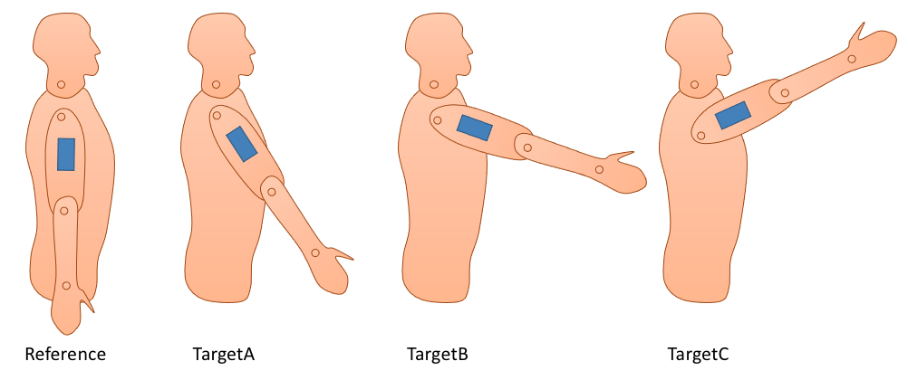

---
jupytext:
  text_representation:
    extension: .md
    format_name: myst
    format_version: 0.13
    jupytext_version: 1.14.0
kernelspec:
  display_name: Python 3 (ipykernel)
  language: python
  name: python3
---

# 📖 Dictionaries

:::{card} Summary
This section presents the `dict` type, how to create a `dict`, how to add and remove elements, and how to loop through it.
:::

The last built-in python type that is very important to know is the dictionary (`dict`). Like lists and tuples, a dictionary contains any number of elements. However, lists and tuples store elements in a sequential way that we address using indexes or slices, whereas dictionaries store elements non-sequentially using keys.

## 📄 Creating a dictionary

A dictionary is created using curly braces `{}` and colons `:`, using a "key: value" syntax:

```{code-cell} ipython3
empty_dict = {}
dict_of_integers = {1: 11, 2: 22, 5: 55}
```

## 📄 Accessing a dictionary

The dictionary we just created contains three elements that we access via keys 1, 2 and 5 using brackets `[]`, exactly like we would index a list or a tuple:

```{code-cell} ipython3
print(dict_of_integers[1])
print(dict_of_integers[2])
print(dict_of_integers[5])
```

To change the value of an existing element:

```{code-cell} ipython3
dict_of_integers[5] = 66

dict_of_integers
```

We can list the available keys in a dictionary using its `keys` method:

```{code-cell} ipython3
dict_of_integers.keys()
```

or we can test if the dict contains a certain key using the `in` keyword:

```{code-cell} ipython3
print(1 in dict_of_integers)
print(3 in dict_of_integers)
```

## 📄 Allowed types

In the previous example, we used integers for both the keys and values. In reality, the value can be of any type, and the key can be of many types, the most common being integers and strings:

```{code-cell} ipython3
dict_of_anything = {
    1: "I have an integer key",
    2: "I have another integer key",
    "three": "I have a string key",
    "some_int_value": 10,
    "some_float_value": 10.0,
    "some_list": [1, 3, 5, 7],
    "some_nested_dict": {
        "a": "A",
        "b": "B",
    },
    100: "ok that's enough",
}
```

```{code-cell} ipython3
dict_of_anything[2]
```

```{code-cell} ipython3
dict_of_anything["three"]
```

```{code-cell} ipython3
dict_of_anything["some_nested_dict"]
```

Combining lists and dictionaries is very powerful and versatile. The following exercise showcases such a combination.

## 💪 Exercise 1

We have a list of dictionaries that contain personal information about the participants of a research project:

```{code-cell} ipython3
participants = [
    {"ID": 101, "Sex": "F", "Height": 1.45, "Weight": 56.0},
    {"ID": 125, "Sex": "M", "Height": 1.72, "Weight": 72.0},
    {"ID": 126, "Sex": "M", "Height": 1.85, "Weight": 94.0},
    {"ID": 132, "Sex": "F", "Height": 1.82, "Weight": 80.0},
]
```

Write a code that iterates through all elements of this list to create a new list that contains all participants IDs: `[101, 125, 126, 132]`.

```{code-cell} ipython3
:tags: [hide-cell]

# Initialize an empty list
ids = []

for participant in participants:
    ids.append(participant["ID"])

# Show the result
ids
```


## 📄 Adding elements to a dictionary

Accessing a dictionary using a key that is not part of the dictionary results in a key error:

```{code-cell} ipython3
dict_of_integers = {1: 11, 2: 22, 5: 55}
```

```{code-cell} ipython3
:tags: [raises-exception]
dict_of_integers[3]
```

However, assigning a value to a key that does not exist creates this key:

```{code-cell} ipython3
dict_of_integers[3] = 33

dict_of_integers
```

## 📄 Removing elements from a dictionary

Similarly to lists, we remove an element from a dictionary using the `pop` method, which both returns the value being deleted, and deletes it.

```{code-cell} ipython3
print(dict_of_integers.pop(1))  # Remove the element with key 1
print(dict_of_integers)
```


## 💪 Exercise 2

We will reuse the previous list of dictionaries that contain personal information about the participants of a research project:

```{code-cell} ipython3
participants = [
    {"ID": 101, "Sex": "F", "Height": 1.45, "Weight": 56.0},
    {"ID": 125, "Sex": "M", "Height": 1.72, "Weight": 72.0},
    {"ID": 126, "Sex": "M", "Height": 1.85, "Weight": 94.0},
    {"ID": 132, "Sex": "F", "Height": 1.82, "Weight": 80.0},
]
```

Write a code that adds a new key `BMI` to each of these dictionaries, that is the body-mass index.

$\text{BMI} = \text{weight}/\text{height}^2$.

```{code-cell} ipython3
:tags: [hide-cell]

for participant in participants:
    participant["BMI"] = participant["Weight"] / (participant["Height"] ** 2)

# Show the result
participants
```

## 📄 Looping through a dictionary using `for`

Similarly to lists, we can loop through every element of a dictionary, using the `for` instruction. The variable returned by `for` is the key. For example, to loop over every keys of this dictionary:

```{code-cell} ipython3
dict_of_anything = {
    1: "I have an integer key",
    2: "I have another integer key",
    "three": "I have a string key",
    "some_int_value": 10,
    "some_float_value": 10.0,
    "some_list": [1, 3, 5, 7],
    "some_nested_dict": {
        "a": "A",
        "b": "B",
    },
    100: "ok that's enough",
}
```

we would do:

```{code-cell} ipython3
for key in dict_of_anything:
    print(f"Key {key} contains this value: {dict_of_anything[key]}")
```


## 💪 Exercise 3

We affix an inclinometer on a person's arm. We ask the person to reach different positions in the sagittal plane, twice.



The inclinometer's readings are stored in a dictionary as follows:

```{code-cell} ipython3
incline = {
    "Reference": -5.0,
    "TargetA_Repetition1": 32.3,
    "TargetB_Repetition1": 73.9,
    "TargetC_Repetition1": 112.1,
    "TargetA_Repetition2": 35.7,
    "TargetB_Repetition2": 82.1,
    "TargetC_Repetition2": 105.8,
}
```

Write a code that creates a new dictionary named `flexion` that calculate the shoulder flexion angle for each repetition of TargetA, TargetB and TargetC, in the form:
```
{
    "TargetA_Repetition1": (flexion angle),
    "TargetB_Repetition1": (flexion angle),
    "TargetC_Repetition1": (flexion angle),
    "TargetA_Repetition2": (flexion angle),
    "TargetB_Repetition2": (flexion angle),
    "TargetC_Repetition2": (flexion angle),
}
```

The flexion angle is calculated as the incline in the target position, minus the incline in the reference position. Your code must adapt to any number of target positions, and any number of repetitions.

```{code-cell} ipython3
:tags: [hide-cell]

# Create an empty dictionary
flexion = {}

for key in incline:
    if key != "Reference":
        flexion[key] = incline[key] - incline["Reference"]

# Show the result
flexion
```
