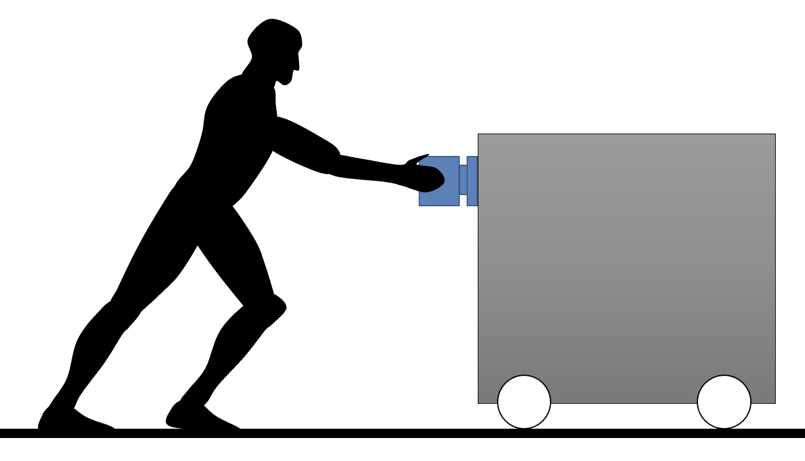

---
jupytext:
  text_representation:
    extension: .md
    format_name: myst
    format_version: 0.13
    jupytext_version: 1.14.0
kernelspec:
  display_name: Python 3 (ipykernel)
  language: python
  name: python3
---

```{code-cell} ipython3
:tags: [remove-cell]

%matplotlib inline
```

# 💪 Exercise 6

We repeat [this exercise](python_for_exercise4.md), but this time instead of measuring the speed of the carriage, we measure its position.



Someone pushes a carriage using a dynamometer. The push force and position are measured in newtons and meters every tenth of a second, during five seconds. We have these two lists where data have been acquired at 10 Hz:

```{code-cell}
push_force = [
    91.19, 99.22, 93.11, 91.76, 94.93, 96.54, 92.27, 96.01, 92.48,
    94.89, 91.55, 90.82, 97.91, 93.19, 95.65, 93.07, 93.65, 90.57,
    98.71, 99.97, 95.72, 96.27, 92.67, 93.4 , 98.84, 92.63, 97.03,
    93.93, 98.34, 95.82, 99.39, 99.29, 92.74, 90.29, 94.57, 90.69,
    93.16, 95.01, 93.16, 97.04, 97.23, 98.9 , 90.26, 97.46, 92.4 ,
    90.84, 97.39, 93.56, 97.47, 93.93
]

carriage_position = [
    111.5, 111.613, 111.73, 111.852, 111.98, 112.103, 112.225, 112.34,
    112.452, 112.567, 112.692, 112.818, 112.952, 113.085, 113.228, 113.37,
    113.52, 113.666, 113.813, 113.969, 114.13, 114.296, 114.454, 114.602,
    114.749, 114.887, 115.033, 115.186, 115.347, 115.511, 115.676, 115.844,
    116.017, 116.199, 116.386, 116.568, 116.745, 116.922, 117.095, 117.262,
    117.424, 117.592, 117.757, 117.931, 118.113, 118.289, 118.469, 118.644,
    118.826, 119.001
 ]
```

Write a function named `calculate_speed_and_power` that would have this docstring:

```
def calculate_speed_and_power(force, position, sampling_frequency):
    """
    Calculate speed and power based on force and position.

    Parameters
    ----------
    force : list[float]
        A list of forces in newtons.
    position : list[float]
        A list of positions in meters. Its length must be the same as `force`.
    sampling_frequency : float
        The frequency at which the positions were measured in Hz.
        
    Returns
    -------
    list[dict]
        A list of the same length of `force` and `position`, that contains
        dictionaries with the following keys:
        - 'Force': force in newtons
        - 'Position': position in meters
        - 'Speed': speed in m/s
        - 'Power': power in watts.

    Example
    -------
    To get the power at the 5th sample, we would do:
    >>> data = calculate_speed_and_power(force, position, sampling_frequency)
    >>> power_5th_sample = data[4]['Power']

    """
```

:::{tip}
You are encouraged to reuse the functions you wrote in these [previous](python_for_exercise4.md) [exercises](python_for_exercise5.md).
:::

```{code-cell}
:tags: [hide-cell]
def calculate_speed_and_power(force, position, sampling_frequency):
    # Calculate speed based on position
    speed = calculate_speed(position, sampling_frequency)

    # Calculate power based on speed and force
    power = calculate_power(force, speed)

    # Generate a list of dictionaries with this information
    output = []
    for i in range(len(position)):
        output.append(
            {
                "Force": force[i],
                "Position": position[i],
                "Speed": speed[i],
                "Power": power[i],
            }
        )
        
    return output

# Test it
data = calculate_speed_and_power(
    push_force,
    carriage_position,
    sampling_frequency=10
)

data[4]
```
