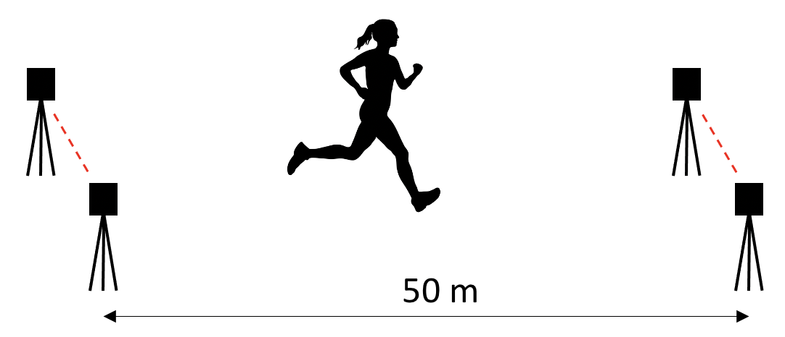

---
jupytext:
  text_representation:
    extension: .md
    format_name: myst
    format_version: 0.13
    jupytext_version: 1.14.0
kernelspec:
  display_name: Python 3 (ipykernel)
  language: python
  name: python3
---

# Arguments and default values

## Positional arguments

Up to now, we called functions using an ordered list of arguments: each argument was assigned using its position. For instance, in this function:

```{code-cell} ipython3
def print_full_name(first_name, last_name):
    """Print the full name of a person."""
    print(f"{first_name} {last_name}")
```

We know that the first argument should be the first name, followed by the last name. Therefore, we would call this function using:

```{code-cell} ipython3
print_full_name("Catherina", "Smith")
```

## Keyword arguments

In Python, it is also possible to call functions using keyword arguments. To this effect, we directly assign values to the argument names using `=` signs. This can make the code still clearer:

```{code-cell} ipython3
print_full_name(first_name="Catherina", last_name="Smith")
```

Note that keyword arguments can be assigned in any order:

```{code-cell} ipython3
print_full_name(last_name="Smith", first_name="Catherina")
```

For very simple functions, using keyword arguments is not that useful. However, some functions may have lost of arguments, with many of them being optional. For example, let's look at the signature of Pandas' `read_csv` function (we will use Pandas later in this book):

```
pandas.read_csv(
    filepath_or_buffer,
    sep=NoDefault.no_default,
    delimiter=None,
    header='infer',
    names=NoDefault.no_default,
    index_col=None,
    usecols=None,
    squeeze=None,
    prefix=NoDefault.no_default,
    mangle_dupe_cols=True,
    dtype=None,
    engine=None,
    converters=None,
    true_values=None,
    false_values=None,
    skipinitialspace=False,
    skiprows=None,
    skipfooter=0,
    nrows=None,
    na_values=None,
    keep_default_na=True,
    na_filter=True,
    verbose=False,
    skip_blank_lines=True,
    parse_dates=None,
    infer_datetime_format=False,
    keep_date_col=False,
    date_parser=None,
    dayfirst=False,
    cache_dates=True,
    iterator=False,
    chunksize=None,
    compression='infer',
    thousands=None,
    decimal='.',
    lineterminator=None,
    quotechar='"',
    quoting=0,
    doublequote=True,
    escapechar=None,
    comment=None,
    encoding=None,
    encoding_errors='strict',
    dialect=None,
    error_bad_lines=None,
    warn_bad_lines=None,
    on_bad_lines=None,
    delim_whitespace=False,
    low_memory=True,
    memory_map=False,
    float_precision=None,
    storage_options=None
)
```

It has lots of arguments, most of them being optional. In this case, it makes no sense to remember the order of every argument, and using keyword arguments is much preferred.

:::{tip}
It is possible to use both lists of arguments and keyword arguments in a same function call. We begin with the list of arguments, which are being assigned based on their order, and we end with keyword arguments. For instance:

```
pandas.read_csv(filename, delimiter=',')
```
:::


## Optional arguments (arguments with default values)

In the `pandas.read_csv` example above, the only needed argument is the name of the csv file to read. Every other argument has a default value, and exists only to modify the default behaviour of the function.

Let's examine this concept with a simpler function. We define the following function that calculates the ground reaction force based on the acceleration and mass of a person's center of mass:

```{code-cell} ipython3
GRAVITATIONAL_CONSTANT = 9.81  # m/s2


def calculate_reaction_force(mass, acceleration):
    """
    Calculate the vertical reaction force based on the mass and acceleration.

    Parameters
    ----------
    mass : float
        Mass of the person in kg.
    acceleration : float
        Acceleration of the center of mass of the person, in m/s2.

    Returns
    -------
    float
        The ground reaction force, in N.

    """
    return (mass * acceleration) + (mass * GRAVITATIONAL_CONSTANT)


# Test the function
print(calculate_reaction_force(mass=60, acceleration=3.5))
```

:::{good-practice} Constants
Note the different conventions used for GRAVITATIONAL_CONSTANT.

**No magic constants**: Instead of writing plainly 9.81 in the function's return statement, we defined the gravity using a name, and we used that name in the equation. We generally want to avoid "magical" constants here and there: we call them "magical" because after time, we tend to not remember what are those for, other than "magically" making the function work. Using named constants is a good way to auto-document the code and better understanding it later.

**Definition at top of file**: Since a constant is by definition constant, it may be defined anywhere before it's first use. However, it is common practice to define all constants once and at a same obvious place.

**CAPITAL_CASE**: In Python, there is no clear distinction between a variable and a constant. To create constants, we simply assign constant values to variables that we never modify later. To emphesize that a constant should not be modified in any means, it is common practice to user CAPITAL_CASE to define constants, and lower_case to define standard variables.
:::

Although this function works very well as is, we may be interested in generalizing it for different gravitational constants, to simulate a similar task in a different gravity. In this case, GRAVITATIONAL_CONSTANT could become a parameter of the function:

```{code-cell} ipython3
def calculate_reaction_force(mass, acceleration, gravitational_constant):
    """
    Calculate the ground reaction force based on the mass and acceleration.

    Parameters
    ----------
    mass : float
        Mass of the person in kg.
    acceleration : float
        Acceleration of the center of mass of the person, in m/s2.
    gravitational_constant : float
        Gravitational constant, in m/s2. Default is 9.81.

    Returns
    -------
    float
        The ground reaction force, in N.

    """
    return (mass * acceleration) + (mass * gravitational_constant)


# Test the function:
print(
    calculate_reaction_force(
        mass=60, acceleration=3.5, gravitational_constant=9.81
    )
)

print(
    calculate_reaction_force(
        mass=60, acceleration=3.5, gravitational_constant=5.2
    )
)
```

However, since most of the time, the gravitational constant really is 9.81 m/s², then we may want to assign it a default value. This is done by using an equal `=` sign in the signature:

```{code-cell} ipython3
def calculate_reaction_force(mass, acceleration, gravitational_constant=9.81):
    """
    Calculate the ground reaction force based on the mass and acceleration.

    Parameters
    ----------
    mass : float
        Mass of the person in kg.
    acceleration : float
        Acceleration of the center of mass of the person, in m/s2.
    gravitational_constant : float
        Gravitational constant, in m/s2. Default is 9.81.

    Returns
    -------
    float
        The ground reaction force, in N.

    """
    return (mass * acceleration) + (mass * gravitational_constant)
```

Now, on earth, the function works exactly as the original one, without having to specify a gravitational constant:

```{code-cell} ipython3
print(calculate_reaction_force(mass=60, acceleration=3.5))
```

but it also adds the possibility to assign another gravitational constant:

```{code-cell} ipython3
print(
    calculate_reaction_force(
        mass=60, acceleration=3.5, gravitational_constant=5.2
    )
)
```


## Exercise

We will redo the example of section [](python_arithmetics_and_variables.md), but this time using a proper function.

A sprinter runs through two timing gates spaced by 50 m. Each timing gate records the time (in seconds) at which the sprinter passes through it.



Write a function named `calculate_speed`, that takes as an argument the time of each timing gate, and that returns the mean velocity of the sprinter between gates 1 and 2, such that calling:

```
print(calculate_speed(1.3, 6.7))
```

prints a value of 9.2593.

In addition, this function should accommodate alternate distances between the timing gates:

```
calculate_speed(1.3, 6.7, distance_gates12=75)
```

Do not forget to include a docstring to your function.


```{code-cell} ipython3
:tags: [hide-cell]

def calculate_speed(time_gate1, time_gate2, distance_gates12=50):
    """
    Calculate the average velocity between two timing gates.

    Parameters
    ----------
    time_gate1, time_gate2 : float
        Time at which the athlete passed through the gate, in seconds.
    distance_gates12 : float
        Optional. Distance between both timing gates, in meters. Default is 50.

    Returns
    -------
    float
        The velocity, in m/s.

    """

    return distance_gates12 / (time_gate2 - time_gate1)


# Test the function:
print(calculate_speed(1.3, 6.7))
print(calculate_speed(1.3, 6.7, distance_gates12=75))
```
