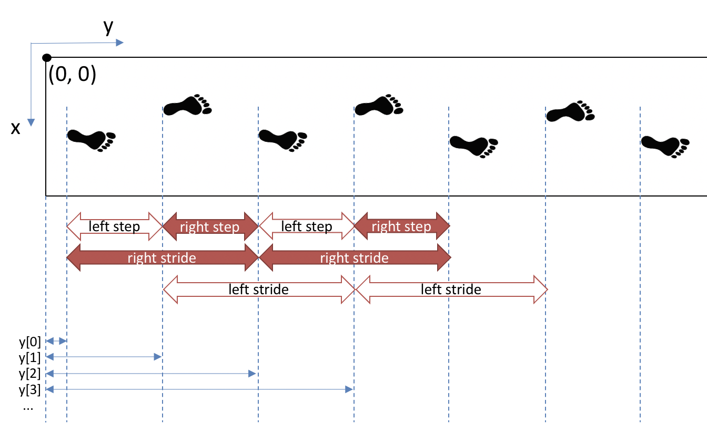

---
jupytext:
  text_representation:
    extension: .md
    format_name: myst
    format_version: 0.13
    jupytext_version: 1.14.0
kernelspec:
  display_name: Python 3 (ipykernel)
  language: python
  name: python3
---

# Creating and indexing lists/tuples

:::{card} Summary
This section shows what are lists and tuples, how to define them, and how to extract values from them using square brackets `[]`.
:::

A list is, as it names implies, a list of values. A tuple is also a list of values. In fact, the only difference between a tuple and a list is:

- A list can be modified after being created.
- A tuple cannot.

Choosing between a list or a tuple is often philosophical:
- We normally use a tuple to express a constant using a group of variables. The coordinates of a point (x, y) is a good example. Once a point is defined by its coordinates (x, y), there is no use to append a value to it.
- We normally use a list to express an expandable list of values. A series of measurements \[x0, x1, x1, x2, x3\] is a good example. We may add or remove measurements from a list.

:::{important}
We usually use lists more often than tuples in data processing because they are more flexible. Therefore, from now on, we will focus on lists. This being said, **everything on this page also applies to tuples**.
:::

## 📄 Creating lists and tuples

A tuple is defined using parentheses `()`:

```{code-cell} ipython3
coordinates = (1.0, 5.2)
```

A list is defined using square brackets `[]`:

```{code-cell} ipython3
empty_list = []
list_of_integers = [1, 2, 3, 4, 5, 6, 7, 8, 9, 10]
```

## 📄 List contents

Lists can contain any kind of variable:

```{code-cell} ipython3
list_of_strings = [
    "first element",
    "second element",
    "third element",
    "fourth element",
    "fifth element",
    "sixth element",
    "seventh element",
    "eighth element",
    "ninth element",
    "last element",
]
```

It can even contain other lists or any other container type such as dictionaries (that will be shown in section [](python_dicts.md)):

```{code-cell} ipython3
list_of_lists = [
    [1, 2, 3],
    ["one", "two", "three"],
    [1, 2, 3, 4, 5],
]
```

And it can even contain different types:

```{code-cell} ipython3
list_of_anything = ["a string", 0, 4.5, (2 + 3j), False, [1, 2, 3], {"key": "value"}]
```

## 📄 Indexing a list

Every element of a list is accessible using an index. The first data is at index 0, the second at index 1, etc.

:::{note}
Zero-based addressing (first index is 0) is common in generic programming languages such as C, C++, Java, Go, PHP, Ruby, and Rust. Being a generic programming language itself, Python also uses zero-addressing. Other languages that are usually more aimed to mathematics, such as Matlab, R, Julia, and Mathematica, use one-based addressing (first index is 1). No convention is inherently better than another, but for non-programmers, it may take a bit of time to adapt to zero-based addressing.
:::

We index a list using square brackets `[]`:

```{code-cell} ipython3
list_of_strings = [
    "first element",
    "second element",
    "third element",
    "fourth element",
    "fifth element",
    "sixth element",
    "seventh element",
    "eighth element",
    "ninth element",
    "last element",
]

list_of_strings[0]
```

```{code-cell} ipython3
list_of_strings[1]
```

Until you get used to zero-based addressing, this error may happen regularly:

```{code-cell} ipython3
:tags: [raises-exception]

# Get the last element
list_of_strings[10]
```

In this case, this error happened because while the list is indeed 10-element long, the last element is at index 9, not 10.

### Negative indexing

We can address a list from its last element, using negative indexing. The last element is available at index -1:

```{code-cell} ipython3
list_of_strings[-1]
```

the previous at index -2, etc.:

```{code-cell} ipython3
list_of_strings[-2]
```

### Indexing using a variable

In the examples above, we indexed a list using a literal constant. We can also index it using a variable:
```{code-cell} ipython3
i = 3
list_of_strings[i]
```

In any case, the variable must be an integer. Indeed, a list element could not be halfway between two elements. This could cause some unintuitive errors, for example if the index is the result of a calculation that implies a division:


```{code-cell} ipython3
:tags: [raises-exception]
some_value = 6
list_of_strings[some_value / 2]
```

The division resulted in a float, which could not be used as an index. This code would correct this error:

```{code-cell} ipython3
some_value = 6
list_of_strings[int(some_value / 2)]
```


### Nested lists

As seen above, lists can be nested, which means that a list can contain another list. To access a specific element of the inner list, we start by indexing the outer list, then the inner list. For example, to access the first element of the second list of `list_of_lists`:

```{code-cell} ipython3
list_of_lists = [
    [1, 2, 3],
    ["one", "two", "three"],  # <--- "one"
    [1, 2, 3, 4, 5],
]
```

we first access the second list of `list_of_list`:

```{code-cell} ipython3
temp = list_of_lists[1]  # Second element of list_of_lists

temp
```

then we access the first element of this result:

```{code-cell} ipython3
temp[0]  # First element of the second element of list_of_lists
```

or, one one line:

```{code-cell} ipython3
list_of_lists[1][0]
```

where `list_of_lists[1]` returns the list `['one', 'two', 'three']`, and `[0]` addresses this new list.

## 📄 Getting the length of a list

The `len` function returns the length of the list (i.e., the number of elements it contains):

```{code-cell} ipython3
len(list_of_strings)
```

## 💪 Exercise 1

We measured some spatial parameters of gait using an instrumented walkway, as illustrated in Figure 1. This instrumented walkway stores the longitudinal distance between the origin and each heel strike in a list `y`, where each element corresponds to one heel strike:



*Figure 1. Foot coordinates obtained via an instrumented walkway*

We want to calculate the step length, which is the distance between one heel strike and the next one by the opposite foot. For a given participant, we recorded this `y` list:

```{code-cell} ipython3
# y-coordinates of each heel strike, in meters
y = [0.13, 0.72, 1.29, 1.93, 2.55, 3.12, 3.71, 4.34, 4.95, 5.56]
```

Write and test this function:

```
def calculate_step_length(y, step):
    """
    Calculate the step length of a given step.

    Parameters
    ----------
    y : list[float]
        A list of every heel strike's y coordinates for a given recording.
    step : int
        The index of the step we want to calculate, the first step being 0.

    Returns
    -------
    float
        The requested step length.
    """
```

```{code-cell} ipython3
:tags: [hide-cell]

def calculate_step_length(y, step):
    return y[step + 1] - y[step]

# Test it
print(calculate_step_length(y, 0))
print(calculate_step_length(y, 1))
print(calculate_step_length(y, 2))
```

## 💪 Exercise 2

You are happy with your last function, but sometimes, you obtain an IndexError:

```{code-cell} ipython3
:tags: [raises-exception]

calculate_step_length(y, 9)
```

**Question 1)** Explain why this call produces an IndexError.

:::{toggle}
This happens because to calculate a step length, we need two consecutive heel strikes. To calculate the length of step 9, we need heel strikes 9 and 10. However, the last element of `y` is at index 9.

One way to avoid this error is to check that we won't index the list out of its range, before calculating the step length.
:::

**Question 2)** Modify your function so that instead of producing this error, it simply returns 0.

:::{good-practice} Invalid data
For this example, we ask to return 0 for invalid data, but a better practice would be to return {{np_nan}}, which will be seen in NumPy's section [](numpy_arithmetics_and_comparisons.md). Simply return 0 for now since we didn't see NumPy yet.
:::

```{code-cell} ipython3
:tags: [hide-cell]

def calculate_step_length(y, step):
    """
    Calculate the step length of a given step.

    Parameters
    ----------
    y : list[float]
        A list of every heel strike's y coordinates for a given recording.
    step : int
        The index of the step we want to calculate, the first step being 0.

    Returns
    -------
    float
        The requested step length, or 0 if this step could not be calculated.
    """
    if step + 1 < len(y):
        return y[step + 1] - y[step]
    else:
        return 0.0

# Test it
print(calculate_step_length(y, 0))
print(calculate_step_length(y, 1))
print(calculate_step_length(y, 2))
print(calculate_step_length(y, 9))
```
